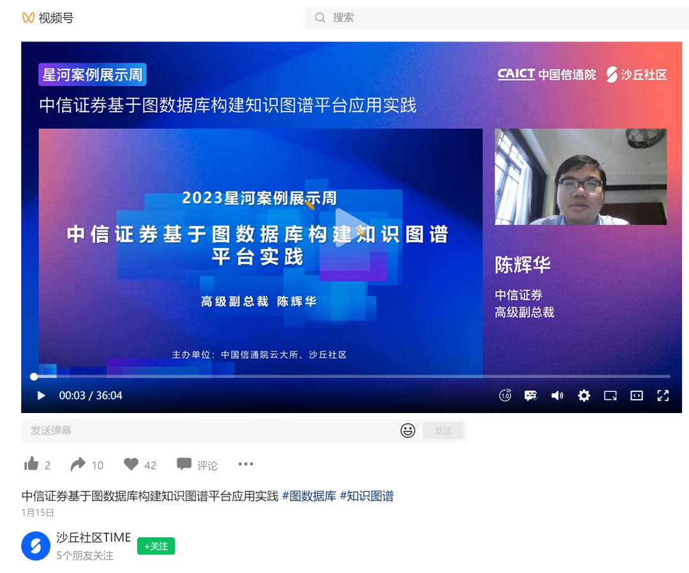
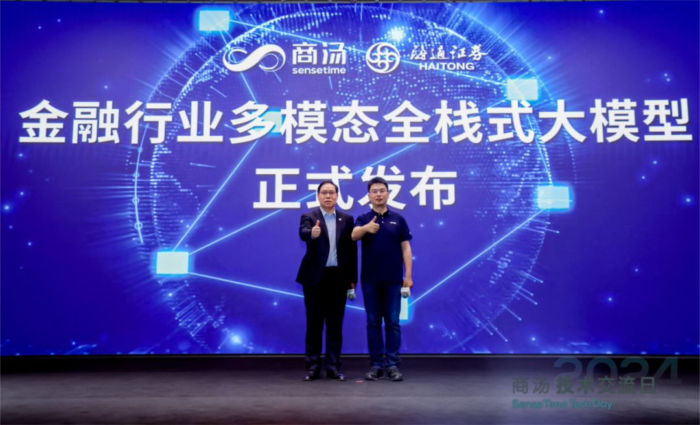
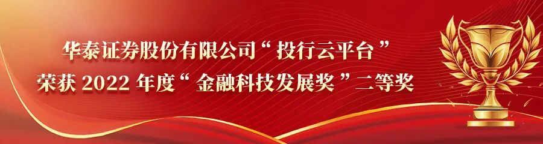

![[Pasted image 20260407203805.png]]

**金融科技发展奖**是中国金融业唯一的部级科技奖项，2021年由人民银行设立，是从1992年的银行科技发展奖升级而来，是国内金融科技领域最具含金量的奖项，又称中国金融科技奥斯卡。

2024年10月18日，人行发布《关于2023年度金融科技发展奖获奖项目的公示》，257个获奖项目中，银行占比最高。小编梳理了其中可能与投行科技相关的项目，具体如下：

## 一等奖（1 名）

### 中信：证券领域一站式知识图谱平台

主要成员：方兴、王桂强、刘殿兴、陈辉华、苑博文、孙少卿、卢山、陈昭铭、史勇、黄美艺、吴中彪、邓伟涛、张天骁、余子安、徐崚峰、钱碧伟、梁文杰、刘钰、师建兴、王欣、郭煜鹏

中信证券基于分布式图数据库 StellarDB，替代国外开源图数据库产品，打造全新的企业级知识图谱平台，构建了同一客户集团画像、科创板关联发现、风险事件报告、全球企业关联图谱、产业链图谱、投研图谱、反洗钱与稽核图谱、元数据图谱等十余个应用。

详细介绍可看下面由成员**陈辉华**分享的文章和视频：

《星河案例ㅣ中信证券：基于图数据库构建知识图谱平台应用实践》，24年 1月30日

## 二等奖（2 名）

### 海通：基于混合架构的证券领域多模态大模型的集成应用

主要成员：毛宇星、陆颂华、任荣、王东、陈颖、高青、赵智鹏、蔚赵春、应原、陈晓、姚振、邹小军、吴涛、张连连、李鑫芸。

完成单位包括：海通证券股份有限公司、上海海通证券资产管理有限公司、海富通基金管理有限公司、海通期货股份有限公司。从完成单位猜测，「e 海言道」在海通旗下多业务板块，针对投研、投顾、投教、合规、办公、研发等业务领域，都有应用尝试。

「e 海言道」大模型是海通证券和**商汤科技**合作成果，双方于23年8月达成战略合作，24年4月23日发布业内首个面向金融行业的多模态全栈式大模型。从发布的新闻稿来看，应用场景大概包括问答、Coding、数字人。

参考文章：

- 《陆颂华：数智赋能向"新"，金融服务添"智"——海通证券e海言道大模型应用实践》，24年8月20日

- 《2024年度上市公司数字化转型最佳实践丨海通证券：海通证券多模态数智员工助力业务创新发展》，24年8月6日

- 《金发奖专栏 | 多模态数智员工平台高效赋能海通证券业务创新》，24年6 月13日

- 《海通证券：虚拟数智人的应用实践与探索》，24年2月7日

### 华泰："简富"投行数字化尽调工作台

主要成员：王玲、杨蓉、王志岩、庄铄、何广瑞、张桐源、江一航、刘忠华、黄国智、于海燕、孟蓉蓉、华舒悦、钟赞、刘英、杨宁忻。

华泰在投行IT始终处于领先位置，其「投行云平台」曾获22年金发奖二等奖。23年金发奖的257个获奖项目中，本项目**最值得投行关注**。

目前，公开渠道没有任何关于「简富」的信息。我猜测，「简富」与「投行云平台」是并列关系，投行承做的主要工作分为3项：做尽调、写报告、推流程，「投行云平台」解决的是推流程，「简富」解决的是做尽调的部分。

参考文章：

- 《打造全业务链数字投行，高质效助力实体经济发展》，24年9月24日

- 《金发奖专栏 | 做好资本市场看门人，金融科技助力一流投行建设》，24年6月3日

## 三等奖（5 名）

### 申万宏源：投行智能一体化平台

主要成员：王明希、朱睿㛃、仇进、陈青、刘雄风、朱磊、郁建超、禹珍、许前威、黄谢意、栗君则。

申万宏源投行一体化平台一直都是采购西点信息的产品，根据金证24年10月17的新闻稿：

近日，金证一举中标华泰证券"投行可配置流程管理与项目管理模块定制化开发服务项目"，这是继申万宏源证券"投行综合业务管理平台"、海通证券"新一代智慧投行业务管理系统"之后，金证新一代投行综合业务数字化平台在头部券商又一次取得新的突破。

从公开信息无法判断，申万一体化投行平台，金证中标的产品与原西点的产品是什么关系。

### 长江：基于大模型的智能应用平台"长江灵曦"在券商典型场景的探索与实践

主要成员：潘进、蔡夏丰、陈颖、张清、谢旭徽、徐泽宇、梁穆清、吴克乾、朱家发、桂银华、周希。

长江在投行IT方面的产品信息较少。关于长江灵曦的参考文章可看这篇：

- 《基于生成式大模型的企业智能助手应用实践》，24年8月23日

### 民生：以提升投行执业质量和服务水平为核心的数字化平台项目

主要成员：王学春、刘洪松、苏欣、袁志和、吴哲锐、李姣、王国仁、曹倩华、杨婷婷、张玉站、孙晓惠

民生较为重视投行业务以及投行IT投入，民生自研过一个投行风险筛查工具，用于挖掘潜在关联方。

### 东吴：新一代债券业务管理系统

申请单位：东吴证券股份有限公司、 建信金融科技（苏州）有限公司

主要成员：范力、姚眺、华仁杰、陈辛、沈俊峰、任川、高景轩、顾刚、陈祥、臧延秋、徐闵菁

东吴也较为重视IT能力建设，23年信息技术投入4.49亿元，东吴曾发布秀财大模型，在对话、BI、Agent、增强搜索方面尝试应用。

说回本项目，不确定与东吴曾发文介绍的东吴证券债投业务管理平台是否是同一产品。

债投业务平台汇集恒生O32系统、用友财务估值系统、票据系统、行情资讯数据、QT群消息等多个数据源，自动生成可视化数据分析图表，利用帆软报表平台进行数据展示，为债券投资总部提供决策支持。

参考文章：

- 《东吴证券：AI赋能券商数字化转型》，24年8月12日

### 国金：大模型基础能力建设及应用场景探索

主要成员：王洪涛、熊友根、徐殿宇、叶志强、周轶珅、杜铁绳、谢永明、李晨、刘志强、李双宏、栾沁羽

国金非常重视大模型的建设以及应用，在"大模型基础能力建设及应用场景探索"项目中，创新性地提出了大模型的**AI外挂式、AI内嵌式、AI原生式**三种结合模式，并提出三种针对通用大模型的优化方法：**提示词工程、结合搜索引擎与业务算法外挂**。

具体可参考以下3篇文章：

- 《证券公司知识管理大模型建设方案及应用示范》，24年8月12日

- 《国金证券：证券行业大语言模型优化方法与应用示范》，24年8月7日

- 《国金证券：证券行业大语言模型的探索与实践》，24年1月25日
