![[Pasted-image-20260407204444.webp]]

本文梳理了投行科技的发展历史，并将我之前的很多观察和思考做了系统化的整理。内容总共分为四个部分：

>   * 第一部分，介绍投行科技发展的四个阶段；
> 
>   * 第二部分，从需求方和供给方的角度，分析市场上的参与主体；
> 
>   * 第三部分，分析投行科技行业目前存在的问题；
> 
>   * 最后一部分，分享我对投行科技未来的几点预测。
 

## 投行科技发展阶段

投行科技/投行数字化是近些年才兴起的概念，针对的的是券商投行业务，并且是以 IPO 为主的股权投行业务，不包括银行的投行业务。

从全球视角来看，在资本市场更加发达的美国、英国，并不存在投行科技这个细分市场，主要是各国监管政策不同，导致投行的职责不同。美国、英国、澳大利亚、香港的招股书一般是由律师来组织起草，投行主要负责整个项目管理、估值和承销。严格来说，投行科技其实属于法律科技的范畴。

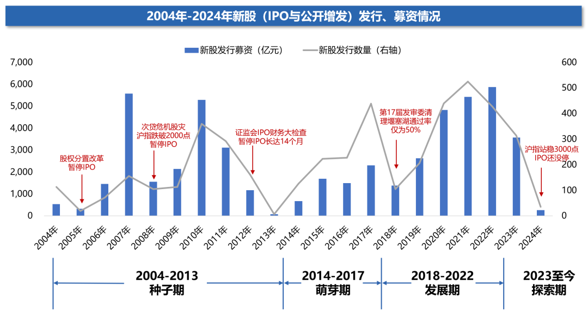

我国保荐制制度于 2004 年推出，至今已有 20 年的时间，结合 IPO 及公开增发情况，我将投行科技分为以下 4 个阶段：

### 种子期：2004-2013

这 10 年里，IPO 暂停 3 次，其中 2012 年 11 月开始的财务大核查，暂停时间最长，共 14 个月。

这个阶段的投行并不存在科技属性。

04 到 10 年，一些券商逐步建立 OA 为主的系统，具有流程审批、用印管理等功能；11 年到 14 年，逐步有了项目管理的理念，个别券商通过系统对投行项目、客户、收入、合同进行基础管理。

### 萌芽期：2014-2017

这四年，IPO 项目迎来了一波高峰，新三板也是大干快上，挂牌公司数量一度超过一万家。

2014 年 9 月，在夏季的达沃斯论坛上，时任总理李克强提出大众创业万众创新。

多种利好因素叠加下，许多投行非系统类厂商在 14 至 17 年陆续成立，这些公司基本是目前的主流厂商，可以分为三类：

**1、信息披露业务相关，创始人从监管机构下海**

黄智、吴非、金翔宇曾经在上交所任上市公司监管员，2013 年 7 月成立信公咨询，主要做上市公司的信披咨询服务，后来推出了数字化业务的子品牌「信公小安」。

2015 年，在深交所工作了 22 年的苏梅辞职并创办价值在线，先后推出了资本市场法规库「价值法库」，服务上市公司董秘办的 SaaS 工具「易董」。

另一条线，新三板也有数千家挂牌公司，股转公司采用的技术路线是 XBRL，杨青松在股权公司负责 XBRL 编制系统和信息披露系统，为了提升三板编报效率问题，2015 年从股转公司辞职并创办财证通，推出了三板信披工具「董秘助手」，公司成立 9 个月后，董秘助手的使用企业数达到 1000 家。

**2、NLP 相关，创始人是技术出身或是中介机构出身**

陈运文，2008 年博士毕业于复旦大学计算机系，曾任百度技术工程师、盛大文学首席数据官、腾讯文学高级总监，15 年 5 月成立达观数据。

鲍捷，美国衣阿华州立大学博士，毕业之后在伦斯勒理工和麻省理工读博士后，曾是三星问答系统 S-voice 第二代系统核心设计师，2013 年离开三星研究院，在硅谷成立了一家公司 MEMECT，2015 年，鲍捷和创业团队从美国回到中国，创立文因互联。

林得苗硕士毕业于清华大学计算机系，曾在惠普中国实验室担任研究员；罗平是中科院计算技术研究所博士生导师，是人工智能领域的专家，高大光曾任职于加拿大鲍尔集团、香港联交所等公司。2017 年 1 月，三人创立庖丁科技。

卢飞飞，本硕就读于南京大学物理系，卡内基梅隆大学物理博士。2012 年起做美股期权量化交易。杜宁，北大金融系本科，香港大学经济学硕士，杜宁的职业背景比较少见，在竞天公诚律师事务所做过律师，在国双科技做过司法领域的产品设计与技术开发。2016 年 1 月，卢飞飞、杜宁成立自回归科技，16 年 5 月推出信披检索工具「搜披露」，也就是后来的见微数据，并于 2019 年卖给了香侬科技。

彭傲立，华中科技大学计算机本科，伦敦政治经济学院管理硕士，曾就职于招商证券、西南证券，投行出身，15 年与孔陈巍、余星润创立上市邦，后改名予信科技，做的是文档自动撰写以及尽调自动化。

**3、特殊的 2 家公司**

第一家就是知名的荣大，在原有的 IPO 申报咨询业务基础上，董事长韩起磊对科技一直比较重视，14 年 8 月成立了荣大科技，并推出市场第一款信披公告检索工具「荣大二郎神」，16 年推出「荣大云协作」。

第二家是西点信息，公司主体虽然成立于 17 年 8 月，但从 11 年就开始创业了，是唯一一家从投行系统切入的创业公司，也是最早开始做投行系统的公司，2019 年 6 月，上市公司顶点软件 900 万元收购西点信息 64.74%股份，估值 1390.18 万元。2024 年 7 月，顶点拟 500 万元收购西点 16.83%股权，估值 2970.89 万元。

在 14-17 年，证券公司投行线在系统建设方面，已经开始向质控管理、底稿管理、后督管理过渡。

### 发展期：2018-2022

这一阶段，监管较为重视证券行业的数字化发展。

2018 年 6 月 11 日，证监会发布《关于建立上市公司重大资产重组独立财务顾问工作底稿科技管理系统的通知》。2020 年 2 月 28 日，协会发布了《证券公司投资银行类业务工作底稿电子化管理系统建设指引》，要求 2021 年起承揽的投行项目需纳入底稿系统进行管理。

在监管的强制要求下，以底稿系统为起点，各家券商逐步建立投行质量评价、大投行、银行流水等系统。各家证券公司基本也是在这一阶段，开始建立专门的投行 IT 团队。

部分券商开始采用自研+集成的方式，建立投行一体化平台，以华泰、中金为典型代表，中金 21 年 7 月启动建设投行一体化平台，在知识沉淀、数据整合及多维检索、文档智能撰写、智能尽调等方面取得一定成果。部分券商缺乏自研能力，依赖外部采购；绝大部分券商尚未建设投行一体化平台，没有投行 IT 团队。

这一阶段的问题：烟囱式的信息化系统，数据分散、不一致，只能算是满足监管基本要求，业务抽象、技术复用、数据挖掘方面做的不够好，并没有形成真正的数字化底座。

从产品供给来看，某些厂商虽然之前没有系统型产品的经验，但在早期依然拿到了一些底稿系统、大投行系统的订单，但逐步被市场淘汰，投行系统市场集中度逐步提高，集中于头部的几家公司。

工具型公司方面，2021 年成立的案牍智能比较突出，股权穿透核查产品，借着注册制热潮，模仿荣大通过券商卖给发行人的模式，取得了千万左右的收入。

### 探索期：2023 至今

2022 年 11 月，ChatGPT 发布，2023 年引爆全球对大模型的关注，一方面给文档智能公司提供了一条新技术路线，另一方面，也让大家对于大模型在投行的应用提出更高的期待。

**1、国外证券行业金融大模型应用**

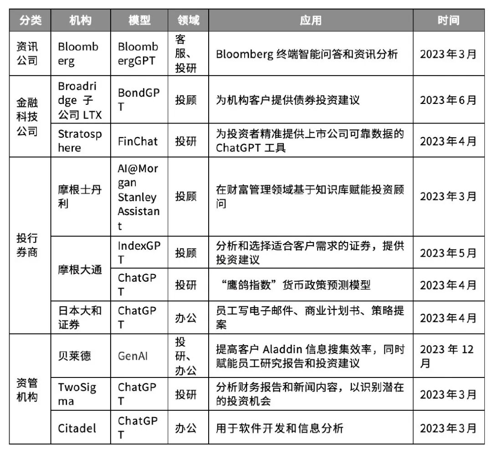

国外金融大模型应用早于国内，基本可分为三类机构：  

（1）**传统投行等金融机构** ，以摩根大通为代表；摩根大通于 2023 年 5 月申请了 IndexGPT 的商标，产品可分析和选择适合客户需求的证券，提供投资建议，正式产品预计将在 2026 年至 2027 年正式推出。  

（2）**金融资讯公司** ，以 Bloomberg 为代表，其 IT 能力和积累的海量数据库具有核心优势；  

（3）**金融科技公司** ，以推出 FinChat/BondGPT 等代表性产品的科技公司为代表。

**2、国内证券行业金融大模型应用**

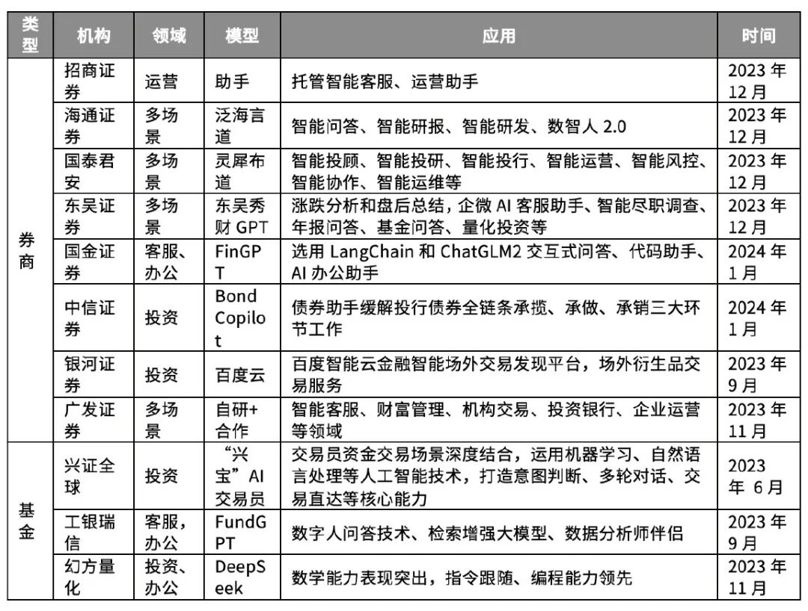

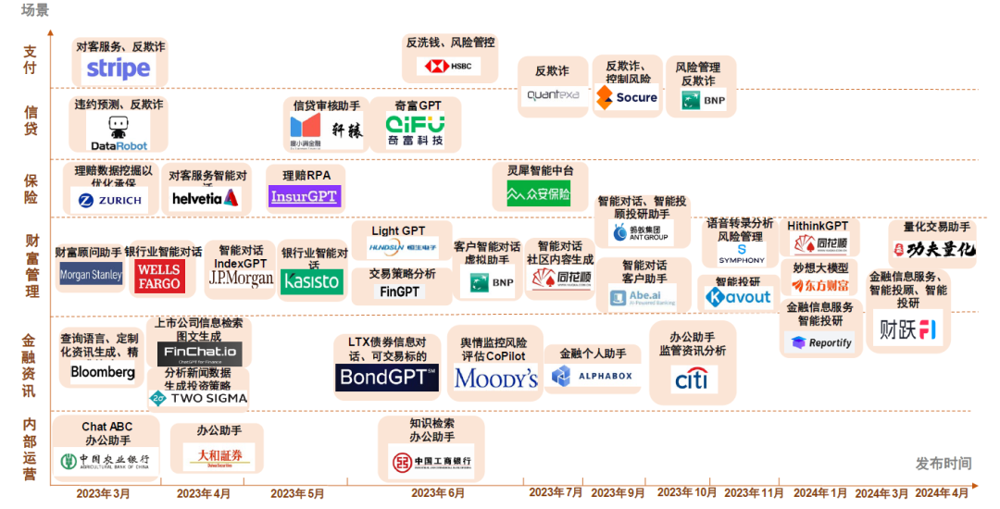

国内布局金融大模型的机构与国外类似，主要是金融资讯公司如同花顺、金融科技公司如恒生和传统券商等金融机构。

广发证券基于大模型构建企业财务风险预警模型，识别人工难以识别的潜在风险。海通证券「泛海言道」、国泰君安「灵犀布道」、东吴证券「东吴秀财 GPT」、国金证券「FinGPT」，都在探索智能投顾、智能投研、智能运营、智能风控和办公等场景应用。

> [!grid] > 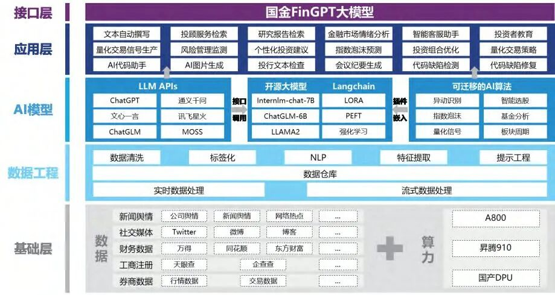 > 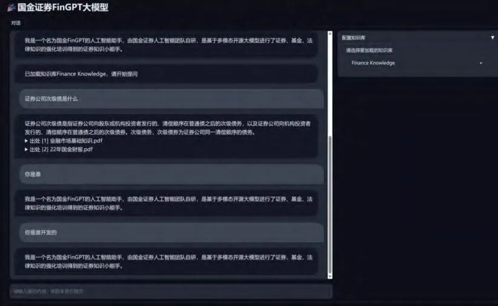

在探索期这个阶段，除了在探索大模型在投行应用，投行系统厂商方面，也进入了一名新玩家——金证股份。

2023 年，金证股份经过深入调研投行数字化转型情况，决定全面进入投行市场，并发布了一体化投行平台产品，希望以更先进的理念、更成熟的技术实现后发制人。

### 当前所处阶段

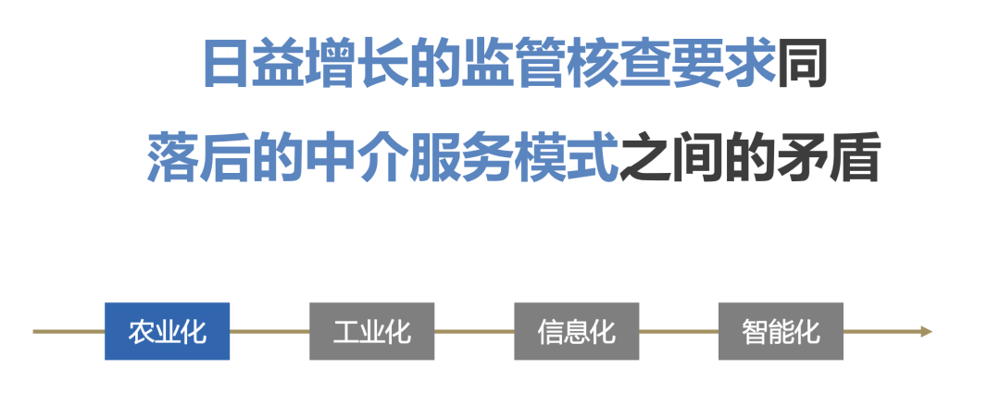

目前投行产业中的主要矛盾是：

日益增长的监管核查要求同落后的中介服务模式之间的矛盾。

粗略把投行科技分为农业化、工业化、信息化、智能化这四个阶段的话，目前我们仍处于手工作业的农业时代，由于底层技术的发展，并且其他很多行业都已经完成了工业化、信息化，导致的结果是，投行并不是顺序逐级发展，而是从农业化同时向工业化、信息化、智能化演进，造成了证券公司投行数字化程度差异巨大。

## 投行科技供需分析

### 需求方

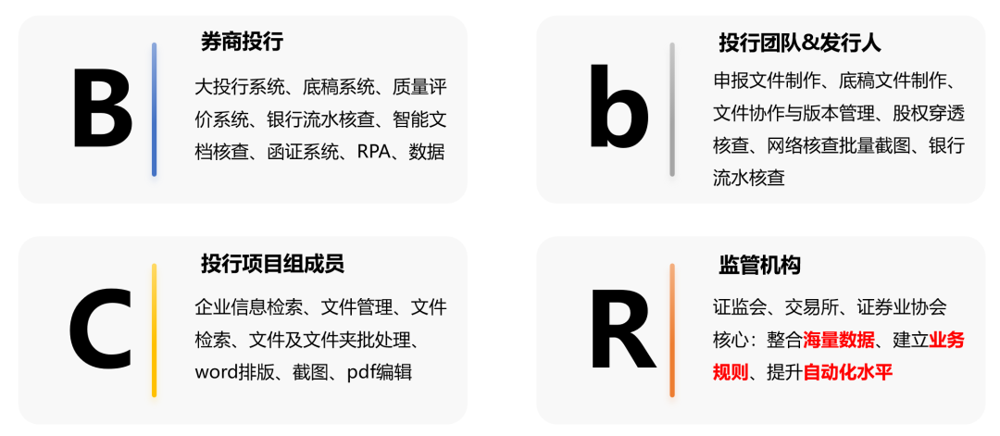

从需求方来看，可以分为四类：B 用户、b 用户、C 端用户和 R 端用户。

**1、B：券商投行**

券商投行是目前投行科技市场的最大客户，需求主要包括：大投行系统、底稿系统、质量评价系统、银行流水核查、智能文档核查、函证系统、RPA、数据等。用自研+外采的方式，逐步完成智能投行的拼图。

为满足合规要求，基本都采用本地部署的方式。出发点一方面是满足监管要求，一方面是增加公司层面对投行在项目、质量、风险方面的控制。

**2、b：投行团队 &发行人**

简单说，就是荣大的业务模式，给投行干活，发行人买单，按项目收费。严格来说，这部分应该属于服务，科技在其中的作用是为荣大这样的服务商内部降本。

b 端用户主要需求包括：申报文件制作、底稿文件制作、文件协作与版本管理、股权穿透核查、网络核查批量截图、银行流水核查等。

**3、C：投行项目组成员**

指的是个人用户，包括投行项目组成员、律师和会计师，是为了解决具体场景下的批量处理或自动化处理问题，提高效率。

个人需求较为分散，例如：企业信息检索、文件管理、文件检索、文件及文件夹批处理、word 排版、截图、pdf 编辑等。

使用的产品很多是个人用 VBA 开发的小工具，比如帅总开发的 word 插件 ibtools，个人开发者维护的小产品，比如审计工具箱。

**4、R：监管机构**

在第一部分介绍投行科技发展阶段的时候，有一条非常重要的线没有提到，就是监管机构。在投行业务技术方面，监管机构要比券商更加先进。

监管机构包括证监会、交易所、证券业协会，我们依次来说。

**证监会**

2014 年开始，在**证监会市场部和信息中心** 的组织下，由**中证监测（2015 年更名为中证报价）和中证技术** 提供技术支持，证监会整合原有分散的的各监管系统，开始建设中央监管信息平台，包含了 20 多个子系统，这是证监会首次在监管应用系统和监管数据方面实现了大统一。（监管科技 2.0 阶段）

2017 年，证监会开始研究资本市场的大数据监管，参考全球范围内监管科技的应用情况，2018 年 8 月底，证监会发布《中国证监会监管科技总体建设方案》；标志着证监会完成了监管科技建设工作的顶层设计，并进入了全面实施阶段。

《总体建设方案》的三个目标：

>   * 一是完善各类基础设施及中央监管信息平台建设，实现业务流程的互联互通和数据的全面共享，形成对监管工作全面、全流程的支持。
> 
>   * 二是积极应用大数据、云计算等科技手段进行实时数据采集、实时数据计算、实时数据分析，实现对市场运行状态的实时监测，强化市场风险的监测和异常交易行为的识别能力，及早发现、及时处置各类证券期货违法违规行为。
> 
>   * 三是探索运用人工智能技术，包括机器学习、数据挖掘等手段为监管提供智能化应用和服务，优化事前审核、事中监测、事后稽查处罚等各类监管工作模式，提高主动发现问题能力和监管智能化水平，促进监管模式创新。
> 
> 

《总体建设方案》明确了监管科技 3 个阶段的主要工作内容：

监管科技 1.0（电子化工具）：通过采购或研制成熟高效的软硬件工具或设施，满足会内部门和派出机构基本办公和特定工作的信息化需求，提升监管工作的数字化、电子化、自动化、标准化程度。

监管科技 2.0（中央监管信息平台，2014-2016）：通过不断丰富、完善中央监管信息平台功能，优化业务系统建设，实现跨部门监管业务的全流程在线运转，为大数据、云计算、人工智能等技术在监管科技 3.0 阶段的应用打下良好的基础。

监管科技 3.0（智能监管，2017 至今）：建设一个运转高效的监管大数据平台，综合运用电子预警、统计分析、数据挖掘等数据分析技术，围绕资本市场的主要生产和业务活动，进行实时监控和历史分析调查，辅助监管人员对市场主体进行全景式分析、实时对市场总体情况进行监控监测，及时发现涉嫌内幕交易、市场操纵等违法违规行为，履行监管职责，维护市场交易秩序。

《总体建设方案》包含了 7 个重要方向：

>   1. 行政许可类辅助分析
> 
>   2. 公司信息披露违规及财务风险分析
> 
>   3. 经营机构违规行为及财务风险分析
> 
>   4. 证券期货服务机构尽职行为分析
> 
>   5. 市场运行分析
> 
>   6. 违法交易行为分析
> 
>   7. 非法证券期货行为分析
> 
> 

在这七个方向下设定了 32 个应用场景，如拟上市公司画像、上市公司画像、内幕交易、财务舞弊分析等。

同时要建设关联账户分析、财务报表分析、实体画像、交易异常检测、舆情分析、金融文档分析六大基础分析能力。

证监会的中央监管信息平台与各交易所的监察监管系统构成了统一的整体。沪深交易所在内幕交易、市场操纵、信息披露等方面已经建立了监察系统，下方介绍交易所的时候会展开讲。交易所监察系统的数据与证监会的数据进行整合后，可以更有效地发现各种违规线索。比如交易所发现某个上市公司信息披露出现了异常，就可以将异常情况通过中央监管信息平台传送给辖区的证监局，证监局核查后再反馈给交易所，通过数据流动形成完整的监管链条。

2020 年 4 月，证监会重构科技监管体系，成立了科技监管工作委员会和科技监管局，形成了科技监管局、信息中心为一体，中证数据、中证技术为两翼的监管组织架构。2020 年 6 月正式成立证监会科技局，由姚前担任局长，直至 2024 年 4 月 26 日。

姚前在任期间，重点打造了：

>   * **网** ：改造监管业务专用证联网，实现更加广泛的互联互通；
> 
>   * **云** ：建设两地三中心监管云，为应用系统建设和数据分析服务提供有力支撑；
> 
>   * **库** ：建设完善监管大数据仓库，统一底层数据，支持系统各类科技建设项目；
> 
>   * **链** ：建成覆盖全部 35 家股交中心的监管链-业务链双层体系；
> 
>   * **平台** ：构建应用全面覆盖、流程相互协同、数据上下贯通、智能技术有效应用的智慧监管平台。
> 

并于 2021 年 10 月 21 日发布**《证券期货业科技发展“十四五”规划》** ，2023 年发布**《证监会智慧监管 IT 战略规划》** 等顶层设计文件。

**深交所**

交易所目前承担了监管科技的核心执行层面工作，下面介绍下深交所的数字化情况。

深交所从 2011 年开始数字化探索实践，开展数字化服务平台和数字化监管平台建设。2019 年，直接参与深交所信息化建设的人员已达到 688 人，其中开发测试人员 546 人，占比 79%。

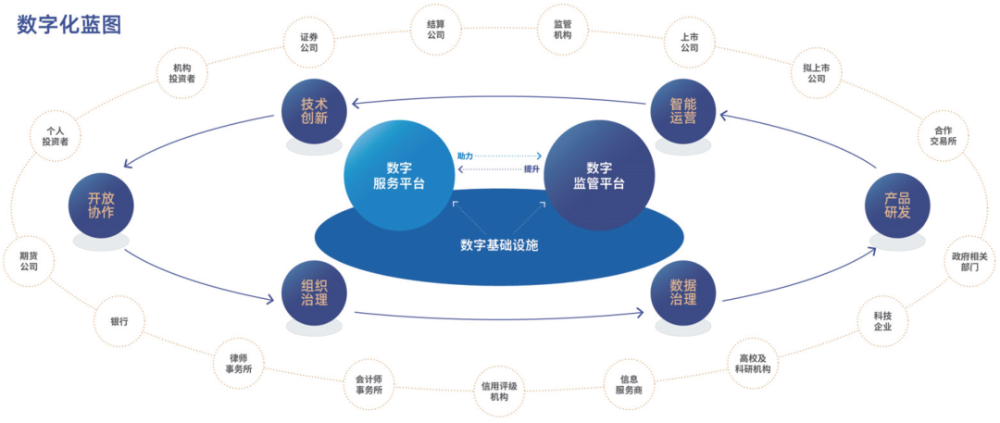

深交所监管平台主要围绕交易监管、公司监管、会员监管、风险监测四大领域。

服务平台包括：企业融资对接服务平台**科融通（V-Next）**、为拟上市企业提供一站式服务的**「上市通 APP」** 。

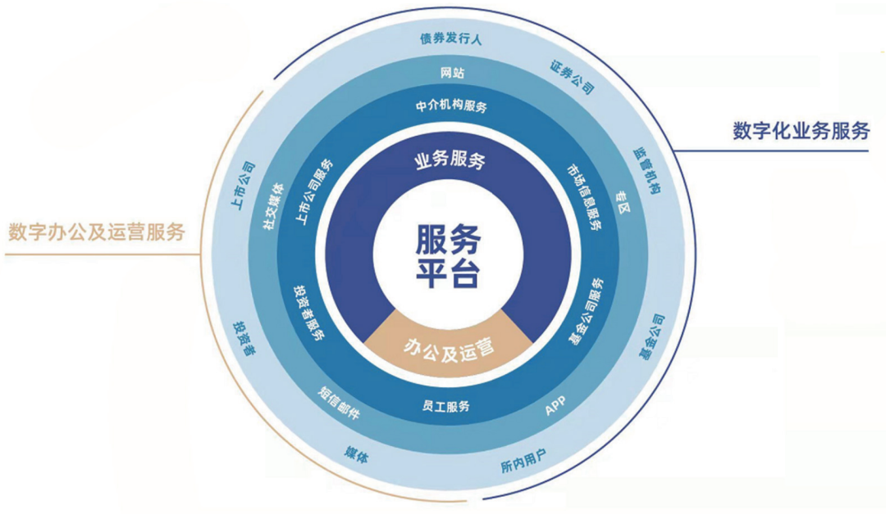

深交所积极与外部机构合作，曾共同开展上市公司财务异常识别、证券市场运行风险监测、产业链图谱共建、区块链平台及行业应用等研究项目。此外，深交所承接了证监会智能舆情分析、信息披露文档合规性分析等科技监管基础能力建设任务。

深交所披露过的与投行相关的系统，包括：

**新一代监察系统（交易监管）**

由深交所自主研发，集成了交易、登记、结算数据和上市公司、证券公司等相关信息，对证券交易活动进行实时动态监控和统计分析。

新版监察系统是具有中国特色的监察系统，充分发挥穿透式制度优势，在监控手段、调查手段、监管对象、监控模式、知识管理、用户界面、数据资源等七个方面实现大转变，推动深交所一线交易监察能力再上新的台阶。新版监察系统作为全功能、一体化的智能监察工作平台，包括六大工作平台、三类基础分析服务、三类知识管理模块、多类智能分析模块，以及完备的系统管理和安全审计，可以支持不同产品的差异化监察以及跨品种、跨市场的联动监察。

曾成功挖掘上报内幕交易、市场操纵、趋同交易（老鼠仓）等各类违法违规线索，发现并协助查处了证券市场操纵最重量刑案，“吴某某”黑嘴案、“伪市值管理”系列操纵等案件。

2019 年，在商业公开竞标中，深交所击败众多全球顶尖系统供应商，中标巴基斯坦交易所技术系统升级项目，于 2023 年 5 月 15 日正式上线启用。

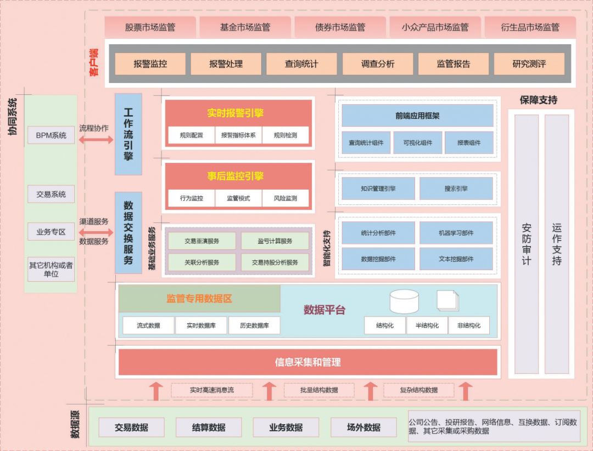

**企业画像系统（又名“上市公司智能监管平台”）（公司监管）**

深交所自主研发，是业内首个面向上市公司监管的智能辅助系统，荣获第七届证券期货业科学技术二等奖和中国人民银行 2020 年度金融科技发展一等奖。

企业画像系统并非完全取代监管人员实现自动监管，而是定位于智能监管辅助系统。于 2016 年底启动，2018 年 8 月一期上线，2019 年 5 月二期上线。目前完成三期建设，正推进四期建设。已广泛应用于公司监管、IPO 审核、上市推广、现场检查等与企业相关的监管全业务链条。

企业画像系统现已实现七大功能：

>   * **智能画像** ：全面整合财务报表、公司公告等内部数据及舆情信息、工商信息等外部数据，建立多维度、全面的体系，通过上市公司画像、关键人员画像、中介机构画像等，全面掌握监管主体信息。
> 
>   * **智能审核** ：凝结固化监管工作多年积累的丰富经验，为定期报告审查、IPO 审核、重组审核等提供在线审阅、审核要点定位与分析判断、文本内容自动摘要等功能。
> 
>   * **智能类案** ：系统梳理资本市场监管规则、问询函件、处分案例等监管资讯，并可结合具体场景推送同类问题及案例，挖掘过往案例价值，实现监管经验的共享与传承，提升监管尺度的一致性。
> 
>   * **智能评价** ：系统建立了一套多维度的风险识别和分类评价体系，实现上市公司风险指标和分类等级的自动生成，并对可重点风险事项进行可视化展示，通过科技手段深化分类监管、精准监管；探索通过专家经验与 AI 相结合，提升财务舞弊线索识别分析能力
> 
>   * **智能分析** ：深层穿透股权股东关系，挖掘同行业、上下游可比上市公司，为现场检查及非现场监管提供有效线索。
> 
>   * **智能报告** ：根据不同案例智能生成违规处分文书、年报情况概览等监管文档，帮助监管人员高效便捷完成文书处理工作。
> 
>   * **智能填报** ：自动抽取分散各类公告中的业务数据，利用 AI 减轻填报工作量，提高准确度。

**统一风险监测平台**

可覆盖市场运行风险监测、股票质押风险监测、两融风险监测、债券风险监测，实现了事前、事中、事后全过程的风险监测。

市场运行风险监测系统整合了内外部数据，构建市场交易、公司经营、市场资金、市场估值、政策舆情、市场信心六大模块，可实现数据批量导出、报告一键生成等功能。

股票质押风险监测系统完善上市公司股票质押数据库，从市场整体、个股情况、单一股东等维度，通过不同时期纵向对比、同行业公司横向对比等维度进行监测。

融资融券风险监测系统覆盖标的交易、担保证券、会员强制平仓等信息资源。固定收益风险监测系统融合了债券交易、评级数据与发行人财务、监管信息等。

上方介绍是深交所较为核心的三个系统，下面再介绍 3 个小产品。

**上市审核智能辅助系统**

上市公司智能监管平台的子模块。通过沉淀业务人员的经验，提升审核标准化、自动化程度。2020 年 2 月正式上线，2021 年新增了申报材料签章识别、审核关注要点智能计算，数据交叉验证等功能，并于 2021 年 12 月获获央行“金融科技发展奖”二等奖。

**智能舆情系统**

2019 年 5 月 22 日, 深交所与腾讯签署金融科技战略合作协议, 共同成立**「深交所-腾讯金融科技联合实验室」** ，该系统是联合实验室孵化的第一个创新项目，2021 年已顺利落地应用并成功上线深证云。

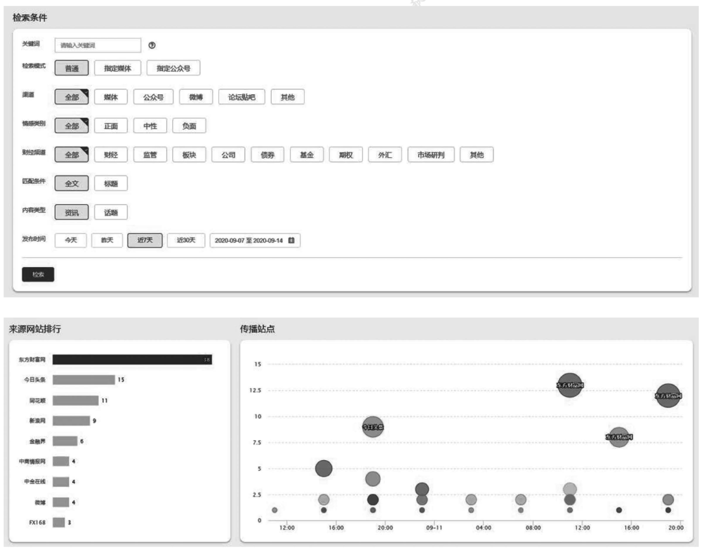

在高级检索功能方面，常规功能包括检索条件设置，例如关键词组合、全文或标题匹配、发布时间等，除此以外，还可以设置特殊检索模式，指定媒体，指定公众号；检索渠道可设置媒体、公众号、微博、贴吧等；情感类别可设置正面、中性或负面。

在智能处理方面，可实现自动化分类、打标，自动生成图表，自动识别敏感信息，比如与领导名字相关的信息。

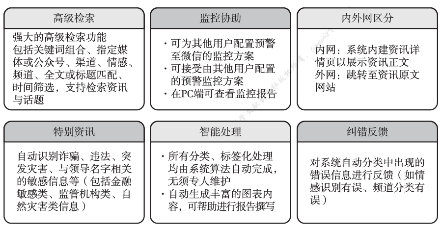

智能舆情系统已在深交所公司监管、上市审核、上市推广等领域进行应用。

**资本市场产业链图谱**

2019 年，深交所联合 11 家行业机构共建资本市场产业链图谱，并于 2021 年 12 月 28 日召开的 2021 深交所技术大会上正式发布。

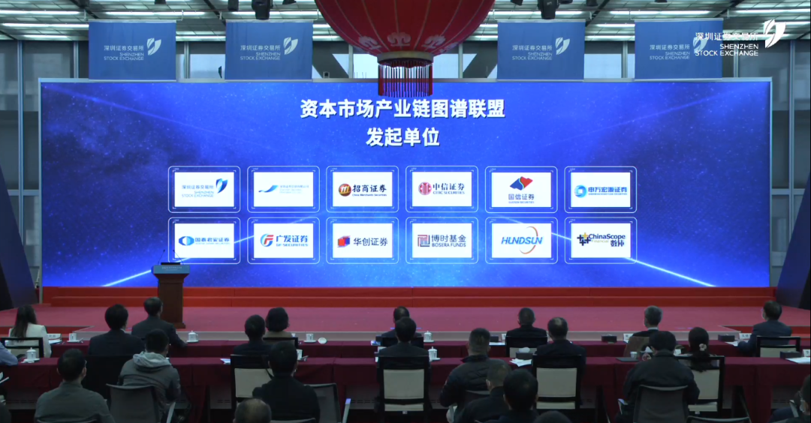

资本市场产业链图谱可用于梳理国民经济各产业之间内在关系，加强风险预警、企业研究产业分析，成果主要包含四个方面：

>   * 产业链图谱标准：包括行业分类、划分依据等业务标准，以及数据模型、采集标准等数据标准；
> 
>   * 产业链图谱数据：涵盖国民经济所有产业分类，刻画产业之间内在关系，包含产业链的公司分布，支持产业关联路径探查分析；
> 
>   * 产业链图谱平台：支持节点维护、关系维护、公司维护、产业地图展示等；
> 
>   * 产业链运营机制：产业链图谱应用维护包括动态维护及激励机制，产业链图谱联盟开放协作、共建共享、赋能行业、创新发展，打造资本市场产业链应用生态。

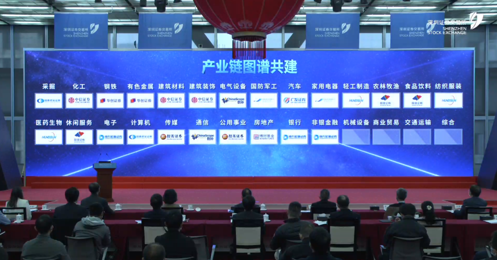

**上交所**

上交所这边，着重介绍下上交所的资本市场知识库。

这个产品来自于 2021 年上交所联合恒生电子承接的证监会科技监管研究课题，目的是建立一个完整统一的资本市场知识库。

这个事情存在几个难点：

>   * **资本市场知识库本体设计困难** ：本体可以理解成知识点，比如尽调问题库，就是所有的尽调问题如何以一个树状结构进行梳理，要自上而下，全面不遗漏，相互之间没有重叠，这个事情很难；
> 
>   * **资本市场知识库缺乏相关的标注数据** ：大量的知识存在于非结构的文本信息中，很难自动化从非结构化文本中提取有效知识；
> 
>   * **知识的高效获取和准确性之间存在矛盾** ：自动化抽取模式的效率最高，但知识的准确性和真实性无法保证。
 

上交所采用的方式是**众包为主，结合专家审核及自动化抽取** 的方式。简单说，就是搭建了一个类似维基百科的平台，大量外部人员在协同工作系统里编辑知识库词条，专家进行审核及质量评价。这些人工数据也是机器学习的训练样本，进一步提升了智能化抽取的准确性和效率，同时构建不同领域的知识图谱。

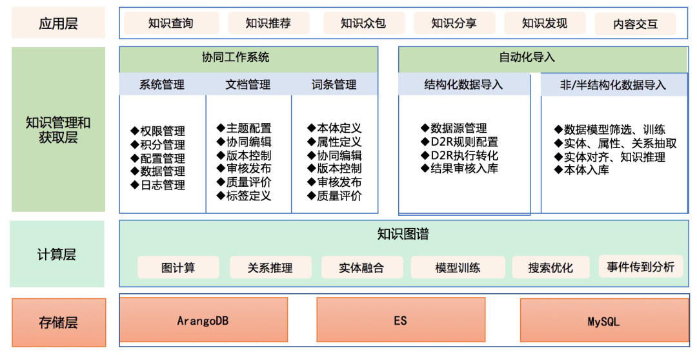

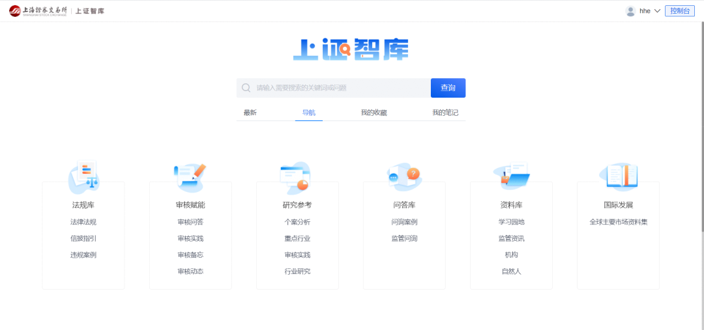

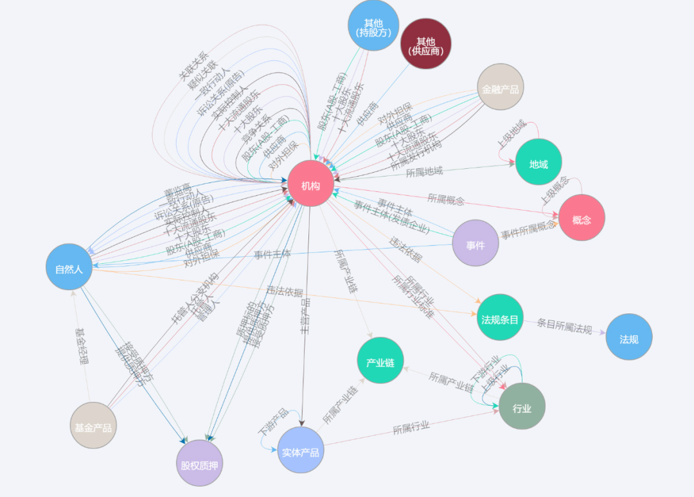

这个资本市场知识库在上交所的 IPO 项目审核中，起到了重要作用。

交易所审核员在查阅招股书时，某章节相关的**法律法规、关联案例、违规案例、审核问询样例** ，系统可自动推荐给审核员，审核员也可以进行人工检索，并且支持审核员进行关联标记。

此外，资本市场知识库聚合了丰富的内外部数据，构建了相关领域的知识图谱，如：股权关系链、产业链、供应链等，辅助监管员快速对公司进行画像，挖掘发行人相关的其他信息。

上交所的这个系统跟我之前在[[投行知识库数据关联的一种实现方法|《投行知识库数据关联的一种实现方法》]]中提及的目标是一致的，我建立的知识库投行百宝箱 | WiKi也是想通过大规模社会化协作的方式完成投行知识梳理，就是把投行相关的尽调问题、尽调方法、法规、案例、解决措施结构化，并且实现关联。但我这种蛮力的方式效果十分有限。

**证券业协会**

中国证券业协会成立于 1991 年，2003 年 3 月，第一届中国证券业协会信息技术委员会会议召开，自此开始了协会信息系统项目建设。

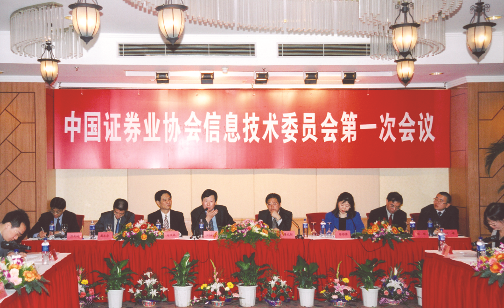

截至 2007 年，协会共建成信息系统 15 个，按服务功能划分为四部分：服务于机构、服务于从业人员、服务于会内办公、服务于外部。

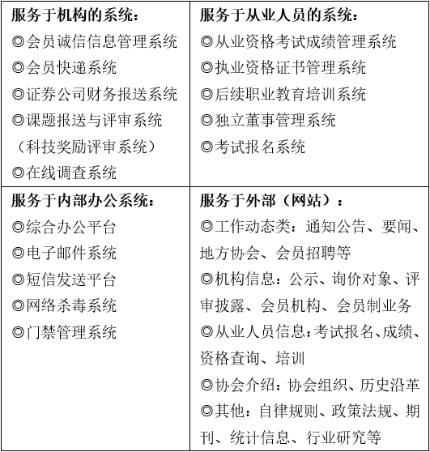

经过多年发展，协会将原有分散的系统整合为一站式服务平台。

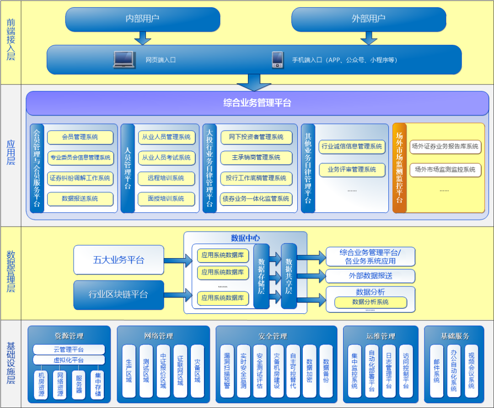

2021 年 1 月，协会上线证券业联盟链（以下简称“证联链”），前面介绍证监会监管科技规划时提到过，证联链是「网云库链」四大基础设施之一，利用区块链可追溯、不可篡改的特性，推动行业数据共享及数据治理。

证联链服务分两类，第一类是基础服务，包括：数据存证、加密报送、隐私计算、数据共享、文件服务；第二类是应用服务，目前包括以下 5 种：

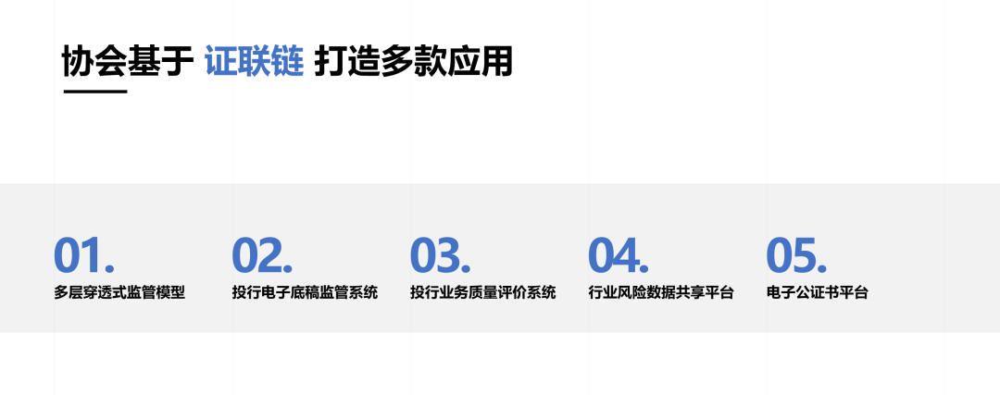

**多层穿透式监管模型**

监管机构包括证监会、交易所及协会等自律组织，被监管对象包括经营机构、投资者等。

2021 年，证联链已与证监会监管链完成跨链对接，一方面改变过去离线报送方式，另一方面，实现监管机构与被监管对象的高效连接，便于监控监测、穿透核查、统计分析。

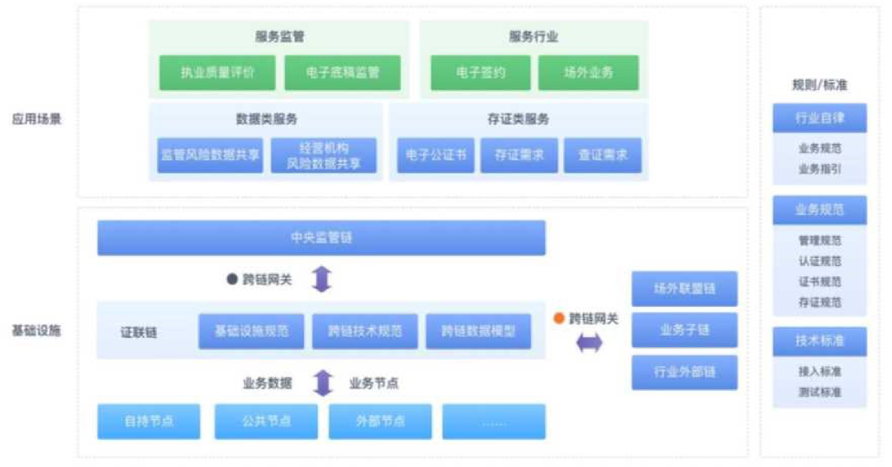

**投行业务电子底稿监管系统**

这个系统投行朋友们比较熟悉。2020 年 2 月 28 日，协会发布《证券公司投资银行类业务工作底稿电子化管理系统建设指引》，要求证券公司需通过底稿系统向协会报送底稿目录、文件名及校验码，校验码相当于底稿文件的指纹，保证入底稿系统的文件不被篡改，协会不用承担所有底稿数据的存储成本，又能对底稿文件进行控制。

我们在前面介绍投行科技发展阶段提过，2018 至 2022 年是发展期，在监管的强制要求下，以底稿系统为起点，各家券商逐步开始建立投行质量评价、大投行等系统。

**投行业务质量评价系统**

2021 年 7 月 9 日，证监会发布了《关于注册制下督促证券公司从事投行业务归位尽责的指导意见》，提到：推动建立证券公司投行业务执业质量评价系统，全面采集投行项目各环节业务信息，做到全程留痕、实时评价、定期汇总，对外公开评价结果。

2022 年 12 月 2 日，协会发布《证券公司投行业务质量评价办法（试行）》，提到：证券业协会主要依托投行业务电子底稿监管系统建立质量评价信息报送平台，归集监管信息、自律信息和行业信息，使用区块链技术实现评价工作全程留痕。

协会于 2022 年 4 月正式上线投行业务质量评价系统，2022 年 8 月，83 家证券公司通过评价系统完成 2166 个项目的数据采集工作。

2024 年，协会为了投行执业质量评价全面覆盖各业务类型、优化评价流程、与底稿监管系统打通底层数据，协会决定打造投行业务自律监管平台，并由立思辰中标。

关于投行执业质量评价，协会目前的做法是否能够真正提升投行业务质量，在第四部分未来展望，会详细分享下我的看法。

**行业风险数据共享平台**

为了解决证券公司之间的数据孤岛问题，吸引更多证券公司共享数据，2021 年，协会与银河证券、信达证券、东兴证券和中信建投证券四家合作，完成行业风险数据共享平台的建设。共享数据上万条，数据类型涉及投资者行政处罚、融资融券、股票质押等。

2022 年，海通证券、国泰君安证券、东吴证券等 8 家证券公司加入风险数据共享平台。

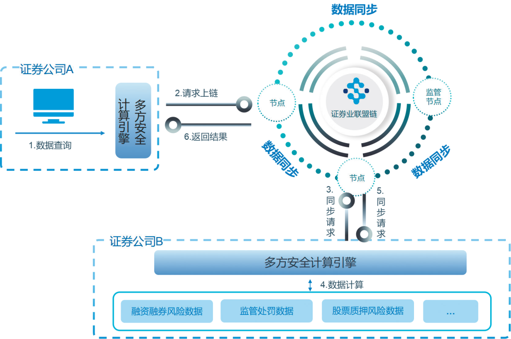

**电子公证书平台**

作用是将电子数据通过区块链存证平台进行链上保存，并通过与司法链对接，实现了非现场类业务办理全过程的可信、可靠留痕和第三方存证，获得司法公信力。

我们在监管科技这部分，花了很大篇幅梳理了证监会、交易所、协会的监管科技发展历程，总结来看，能有以下三个结论：

监管机构在投行方面的技术水平，远远领先于券商投行，一方面是资源投入的差异，一方面是拥有数据的差异；  
监管的强制要求，是目前投行科技市场的核心驱动力；  
监管科技的核心就 3 点：**整合海量数据、建立业务规则、提升自动化水平** ，这 3 点同样适用于投行、三方厂商。

以上就是我们从 B 券商投行、b 投行团队&发行人、C 投行项目组成员、R 监管机构四方分析的投行科技需求部分。

### 供给方

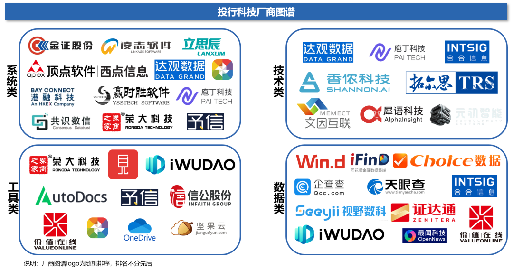

投行科技厂商，按产品可分为 4 类：

**1、系统类**

系统类产品收入占比最高，主要针对 B 端券商客户，基本都采用本地部署，具体产品包括大投行系统、底稿系统、质量评价、IDP、持续督导、函证、流水核查、区块链、机构客户管理等。监管机构也会采购此类厂商的产品。

金证、凌志、立思辰、西点信息，这几家是大投行系统的核心供应商，都是上市公司或其子公司；达观、庖丁做文档审核、流水核查系统；港融是做监管系统的，共识是区块链背景，做底稿、质量评价系统；财证通是做督导系统的，第一家客户是中信建投，21 年到现在已经做了三期了。荣大、赢时胜、予信曾经做过一些底稿系统。

**2、技术类**

技术类厂商都是 NLP 背景的公司，通用技术起家，以 IDP（Intelligent Document Processing，智能文档处理）、OCR、RPA 为主，向 B 端券商客户提供技术能力或者应用平台，投行是其应用领域之一。代表性公司有达观、庖丁、文因互联、合合、香侬、拓尔思、犀语科技、元初等。

监管机构也会采购此类产品，比如，深交所曾采购达观的 OCR 和银行流水，上交所曾采购达观的文本抽取、拓尔思的文本抽取质量控制系统、文因互联的文本抽取。

**3、工具类**

工具类的产品适应场景相对零散，客户一般是 b 投行团队&发行人，以及 C 端的个人。例如，信披公告检索有荣大二郎神、见微数据、吾道搜索；用 Onedrive、坚果云进行底稿协作与共享；文件编辑与版本管理用荣大智慧云、Office365；法规库用春晖投行在线、价值法库。

工具类产品形式以 SaaS 为主，按账号收费，但荣大相对特殊，工具是包在荣大的申报、底稿服务内的，并且是通过券商项目组卖给发行人。

收费的工具类公司，我想着重提一下案牍，这家公司是值得投行科技创业公司学习的案例。案牍是我提到的所有投行科技厂商中，成立最晚的，是在 2021 年；创始人法律+产品出身，以非常小规模的团队、很小切入点的工具产品，取得了千万级的收入。

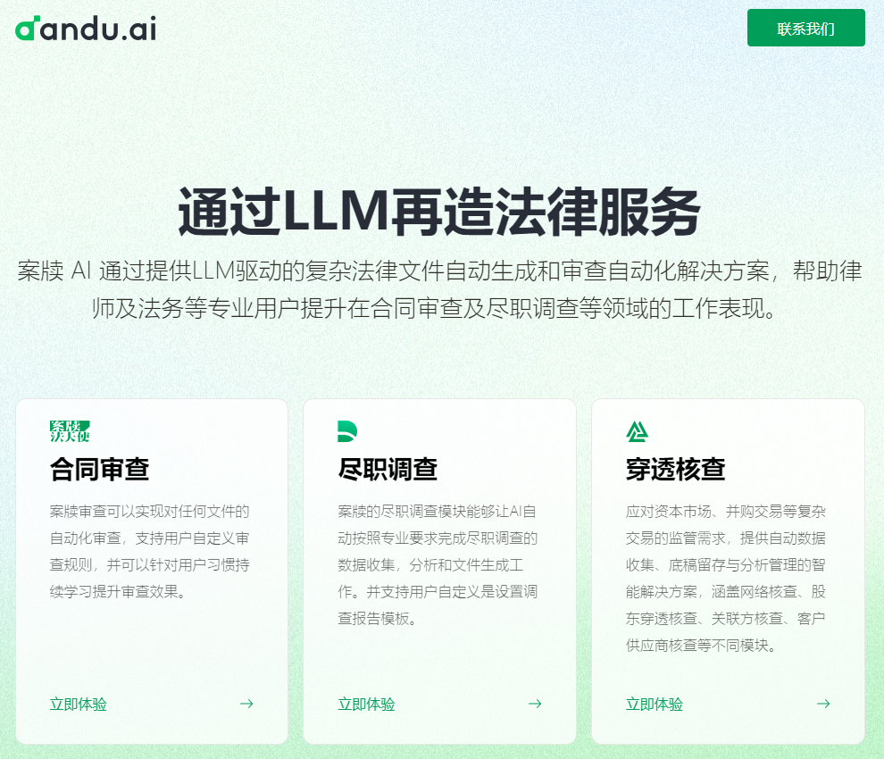

创始人**刘振汉** 本科学的金融学，中国政法 14 级司法文明专业研究生，曾在中伦律师事务所及通商律师事务所从事资本市场及投融资法律业务，而后在法律科技公司理脉（LegalMiner）任解决方案专家。

刘振汉先是做了个尽调导航网站 Oslaw，积累了近 80w 用户；后陆续推出尽调报告自动化生成、网络核查、关联方核查等产品，核心逻辑是将从企查查、天眼查获得的企业数据，经过业务逻辑的处理，组装为客户需要的 word 或 Excel 形式。通过**股权穿透** 这款产品，借着注册制的东风，采用荣大的 to 券商 to 发行人的模式，实现了千万级的收入。近期，案牍在探索大模型在泛法律行业的落地应用，如合同审查、非结构化数据治理等。

案牍的商业化是所有 SaaS 创业公司最羡慕的状态，企查查、天眼查、启信宝、荣大没有做到的事，案牍做到了，靠的就是对用户需求的敏锐洞察。

在投行科技市场，从下而上的这种小机会点，仍然有很多，但每年 500 家 IPO 的红利不在了，案牍的经验非常值得工具型创业公司学习。

同时，在工具类市场，除了公司型厂商以外，还有个重要的组成部分：个人开发者。

大部分个人开发者是在职的中介机构人员。投行背景的很少，如开发投行 word 插件 ibtools、本地法规库的帅远华，投行大白工具箱的李总；审计背景的会更多，比如逆行的狗，开发了青藤数据、审计军火库，一直在探索审计自动化；茶瓜子开发了 word 插件 CPA Helper；何立老师开发的试算平衡表等审计工具。

另一部分是独立的个人开发者，王建彬一个人开发了十多年的**审计报告附注自动生成工具 CPASIT** ，王文铖开发的**审计工具箱** 。

**这些个人开发者，最懂得一线项目组的真实需求。**

**4、数据类**

数据类厂商主要提供数据接口、一次性数据交付、数据服务等，数据类型包括投行业务相关的资本市场数据、企业公开数据、舆情数据等，代表性公司有做金融终端的 Wind、iFinD、Choice，企业信息查询三巨头企查查、天眼查和启信宝，提供资本市场数据的价值在线（易董）、吾道科技、视野数科，提供数据服务的最闻数据、证通股份等。

## 投行科技行业问题

### 投行 IT 投入与业务地位严重不匹配

根据证券业协会《中国证券业发展报告 2023》，2022 年证券行业总部员工加常驻外包专职 IT 人员，投行只有 684 名，占比 3.28%，在各业务线中倒数第二，远远低于经纪业务的占比 39.70%。

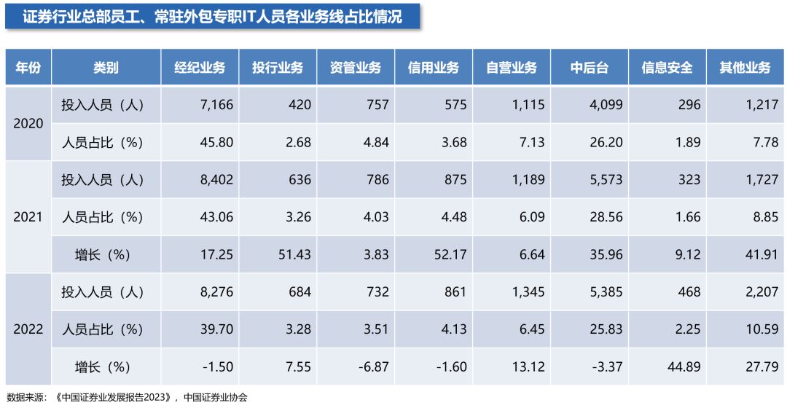

根据《2023 年度合规小兵券商期货基金监管处罚分析报告》，按业务维度来看，投行业务罚单 120 张，仅次于经纪业务的 152 张，排名第二；从人员维度来看，2023 年共处罚从业人员 200 余人，其中处罚投行相关人员 106 人，占比 43.44%，排名第一，涉及前中后台全链条人员，其中最集中的是保荐代表人 70 人。

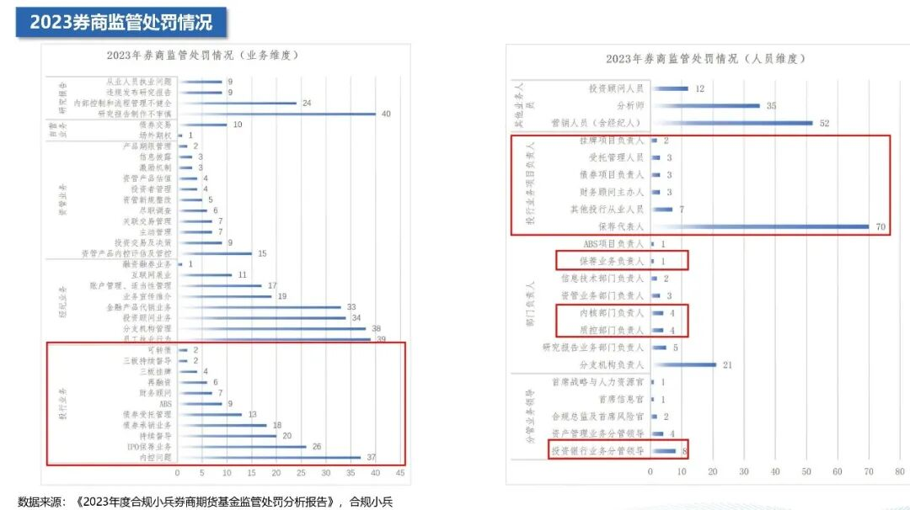

投行是处罚的重灾区，但 IT 投入非常少，二者严重不匹配。

### 市场规模非常小

根据证券业协会《中国证券业发展报告 2023》，2022 年，投行业务 IT 投入占比由**倒数第一进步到倒数第二** ，超过了融资业务，投行 IT 投入占比仅为 1.99%，远低于中后台的 43.10%和经纪业务的 34.36%。

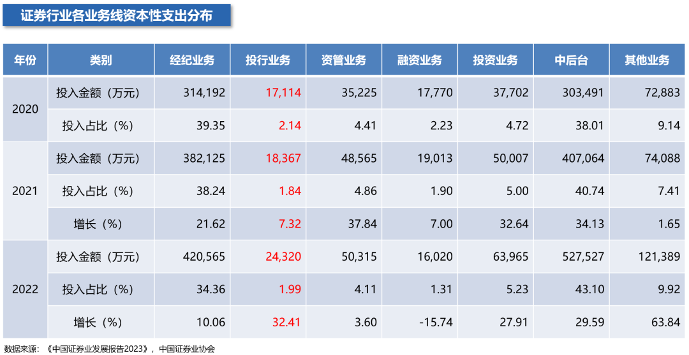

这 1.99%对应的金额仅 2.43 亿元，扣除 684 名投行产研人员的工资，流入投行科技厂商的收入仅有1 亿左右。

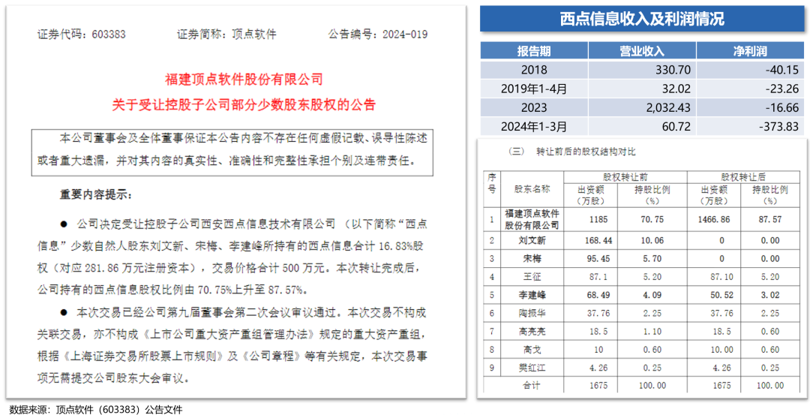

再从投行系统厂商来看。我们前面提到过**西点信息** ，是唯一一家从投行系统切入的创业公司，也是最早开始做投行系统的公司，2019 年 6 月被上市公司顶点软件 900 万元收购了 64.74%股份，估值 1390.18 万元。

西点信息是投行系统厂商里的前三名，根据顶点软件的公告，西点信息 18 年收入 330.70 万，亏损 40.15 万。23 年收入 2032.43 万，亏损 16.66 万。

**投行系统厂商的前三名之一，收入体量也就只有 2000 万，并且持续亏损** 。24 年 7 月，顶点拟 500 万元收购西点部分老股东 16.83%的股权，估值仅有 2970.89 万元。

投行市场规模非常非常小，价格竞争激烈，造成的结果是，市场内厂商越来越少，比如之前做过一些底稿系统的荣大、赢时胜、予信，基本都退出了投行系统市场。同时，因为实施成本很重，现有厂商的收入不足以支撑持续的研发投入。

目前，投行科技市场的主要部分就是投行系统，但是，投行系统并不是一个好市场。

### 自研不是目的，只是手段

早期阶段，市场上没有厂商能提供一体化投行平台的解决方案，券商投行 IT 只能选择自研，采购不同模块的能力或产品，逐步完成一体化投行平台的拼图。

很多时候，三方厂商的模块产品上线之后，可能不能够很好满足业务需求，还要继续再找一家技术厂商给打补丁，这一点在文档抽取方面非常常见。

从厂商角度来看，券商投行的系统类需求简单分成两类：产品型与项目外包型，平台建设一般都属于项目外包型。券商投行 IT 与外包团队之间总是会存在冲突，并且项目建设成本越来越高。一方面是因为，外包公司的收费方式和甲方的利益并不一致；另一方面，外包公司人员的素质、和责任心也不足，如果有转包的话，情况会更差。

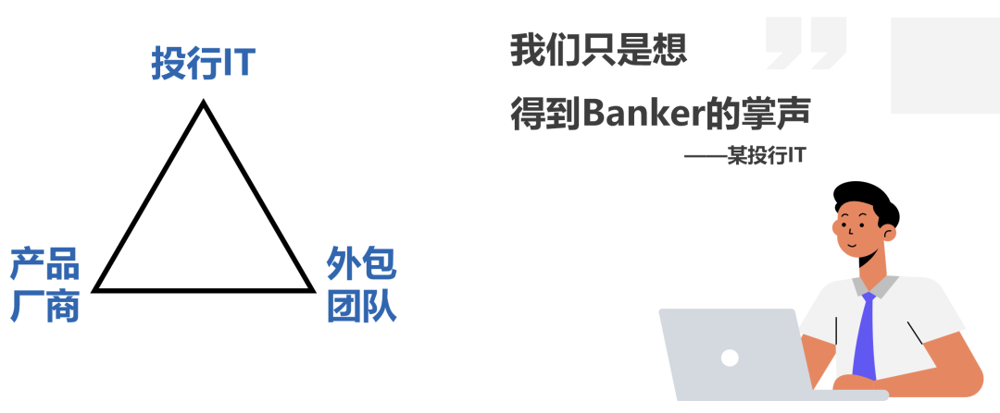

投行 IT、产品厂商、外包团队需要找准定位。投行 IT 应培养优秀的团队，包括产品经理、项目经理、架构师，从业务战略出发，做好整体规划、系统架构，平衡好定制开发和产品集成。产品厂商应把产品做到小而美，不图大而全。外包加强管理和业技融合，提高协同效率。

再说说投行 IT 遇到的另一个问题，跟三方厂商、外包团队废了九牛二虎之力，总算把投行系统上线了，但是投行项目组不用，用了有说不好用，问项目组哪里有问题、有什么建议，项目组也没有人有产品思维，能把需求讲清楚。

投行 IT 心里委屈得很。一位投行 IT 朋友说过：

我们只是想得到 Banker 的掌声而已。

这其实涉及到投行科技产品价值的问题。投行系统基本都为了满足上层的管理需求，并不是从一线人员需求出发，而最高频使用系统的用户是一线项目组。

### 复合型人才少

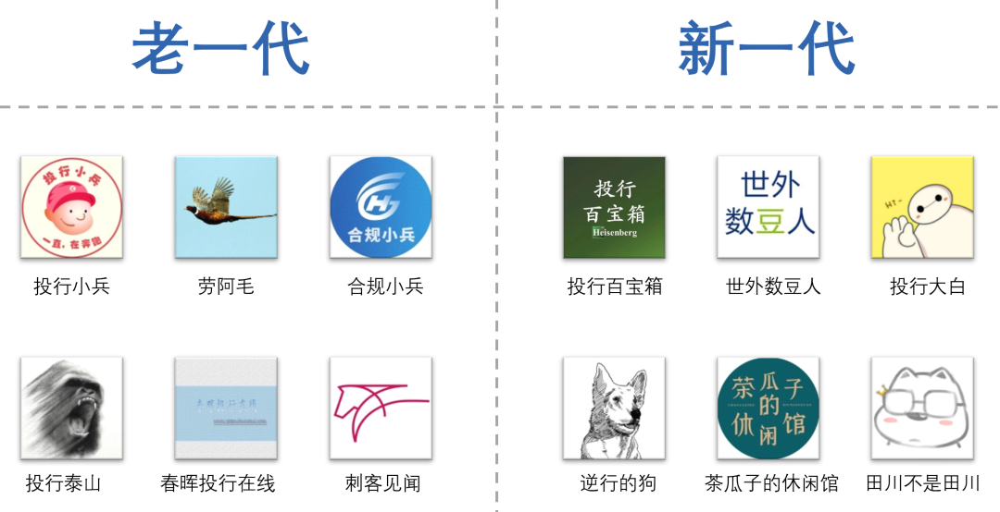

投行圈的网红有不少，投行小兵、劳阿毛、投行泰山、春晖、刺客，还有集体型的合规小兵，这一批前辈都是从业务角度出发，把自己的学习笔记在公开平台分享，从博客、微博、再到公众号。

近几年，有一批新的内容分享者，内容除了文字，也会有视频、工具软件，主题更侧重技术、工具，比如投行相关的世外数豆人、投行大白、投行百宝箱，审计相关的逆行的狗、茶瓜子、田川等。

从创业角度看，审计、律师背景的人员，有很多出来创业做审计系统、核查工具等，投行背景的创业者只有予信的彭傲立。

B 端 SaaS 产品具有很强的业务壁垒，会出现隔行如隔山的情况，产品经理既需要具备产品设计能力，更需要理解投行业务逻辑，了解投行人员业务痛点，对投行有深刻的洞察。无论是投行转产品，还是产品学习投行业务，都存在较大的难度，相对来说，投行转产品会更容易些。

在现在的市场环境下，投行前台转产品经理，也是一条可以考虑的路。大家如果对投行产品经理的岗位有兴趣，欢迎联系我，我可以内推券商投行产品岗和三方厂商的产品岗。

**针对投行科技和数字化，我组建了全市场唯一的社群**，感兴趣的朋友，可以添加小助手微信，微信号是 openib。

### 标准化不足

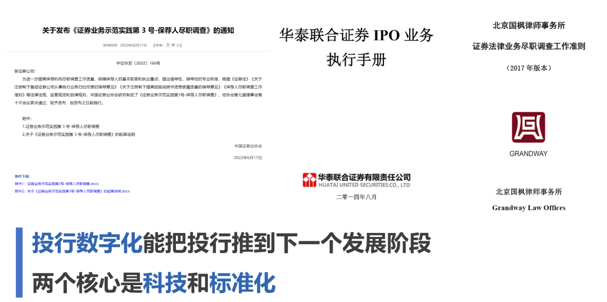

前面提到的上交所的**资本市场知识库** 是一个很好的参考案例。

有朋友会设为投行政策经常变化，投行的价值就在于非标。但我认为，投行底层的逻辑始终没有变，我坚定认为投行数字化能把投行推到下一个发展阶段，解决目前行业存在的很多问题，两个核心就是科技和标准化。

在注册制以前，投行业务规则存在模糊地带，存在大量的窗口指导政策。人员培养只能通过师傅带徒弟，在项目上磨练，实务经验分散在大家的脑子里，缺乏总结。虽然很多券商都有承做标准化手册或尽调指引，协会也发布过几百页的证券业务示范实践，但存在 word、pdf 内的静态知识是没有用的。

需要向上交所一样，把知识先标准化，**标准化之后才能产品化、自动化** ，让知识在投行场景中与工具结合，自动推送，实时更新，这样才能把大家从重复的体力劳动中解放出来，真正实现投行的智能化。

## 投行科技走向何方

最后一部分分享 5 个观点，部分观点可能会有争议，欢迎朋友们在评论区留言，补充您的意见。

### 数据驱动型投行

**1、投行就是数据建模**

我国的发行审核制度以书面审核为主，投行项目从项目立项、内核、申报、上市委审核到注册，全流程都是以各类报告的形式了解发行人。

把这个过程抽象来看，就是一个数据处理及传输的过程。**IPO 就是给发行人建模，申报文件格式准则、协会底稿目录就是数据格式。**

以数据视角来看，投行承做其实是以下几个环节构成：

项目组现场尽调是发行人的数据采集，如搜集底稿资料、函证、走访、访谈等；继而进行数据清洗，如底稿整理、流水 OCR 转换 Excel 等；然后是根据各核查模型进行数据分析，寻找问题；最后是输出决策，如问题整改方案，或是各类书面报告。

投行目前工作量巨大的原因，在于监管要求的核查数据维度增加、颗粒度变细，同时中介机构缺乏有效的方法论与工具，流水核查、股东穿透、穿行测试，均是如此。

律师、会计师的工作同样是这个逻辑，审计领域一直也在探讨数据驱动型的审计该如何发展。

**2、投行数字化的瓶颈在发行人自身的数字化**

IPO 成败的核心其实是发行人自身，关键在于其底层基础数据。目前，发行人的数字化程度仍然很低，数据留存度不足，更别提数据之间的勾稽匹配了。

大部分 IPO 发行人有 ERP，但 MES 等业务系统的渗透率很低的，部分企业甚至仍然采用手工账的方式，不同系统的数据根本无法打通。

现在 IPO 越来越难做，项目持续时间越来越长，一方面是因为发行人的内控等问题规范需要时间，更重要的是，发行人自身的数字化程度不足，体现在以下几方面。

>   * **数据缺失** 。一类是有数据，但没有原始单据；另一类是数据和单据都没有，最常见就是物流单。
> 
>   * **数据有效性不足** 。其实就是数据不准，勾稽不上。例如，只有汇总的物流费月结单，无法匹配至具体产品物流记录；单据缺盖章、缺签字，后补痕迹明显。
> 
>   * **逻辑冲突** 。更多维度数据交叉复核之后，逻辑存在冲突。比如签收时间早于出库时间，合同的收货单位与送货单的收货单位不一致等。
> 
>   * **合理性不足** 。从 IPO 审核角度，为了减少问询，对数据会做一定程度的合理化处理，保证毛利率更平滑、数据波动可解释。但业财数据往往是按下葫芦浮起瓢，经常会忽略对其他指标的异常影响。
> 
> 

IPO 项目，项目组、发行人会花费大量时间进行梳理基础数据，做各种大表、台账。投行数字化的瓶颈，在发行人的数字化。

**3、中介整改理念需转向数据治理**

核准制下，由于堰塞湖的存在，中介的理念是先申报占坑，边排队边整改。

核准注册双轨制下，由于监管审核趋严、信息披露透明，中介整改理念逐步转向利润规模、收入真实性、内控规范性。

在当前的全面注册制之下，上述理念已经不能支撑未来的审核及监管趋势，发行人的所有问题都是过往发展的结果，所有问题的发现、分析、解决都需要底层底稿（也就是数据）的支撑。中介的整改理念应该转向发行人的底层数据治理，并且采用更加科学的理念和工具，针对发行人全量的数据进行治理，这样才能够满足多维度的核查与问询、常态化的现场检查。

然而，虽然各家券商在自身的数据治理投入都非常少，半数以上的券商年数据治理投入金额不超过 200 万元，券商自己内部各业务线之间的数据都没有打通，更别说在投行项目发行人侧的数据治理投入了。

**目前行业最缺的并不是数据治理类工具，而是理念转变，需要从审核视角转为数据视角。**

**4、产业需要重新分工**

技术的发展，会改变行业的分工及作业方式。

建筑行业的数字化就是典型案例，从 CAD 到 BIM 再到 AIGC，目的是打通上游的设计到下游的施工各环节，大家在一个数据模型下协作，同时用机器自动化代替人工。

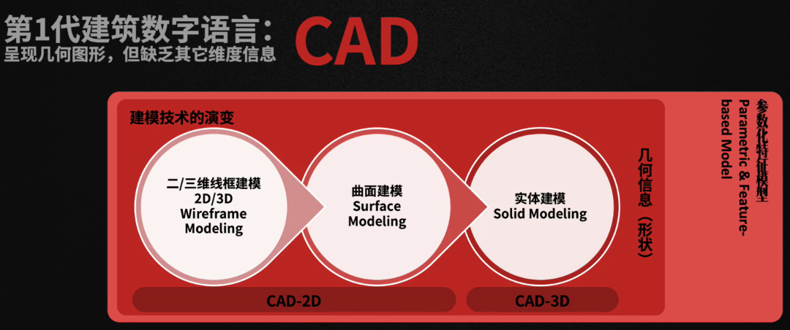

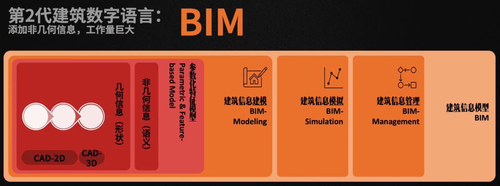

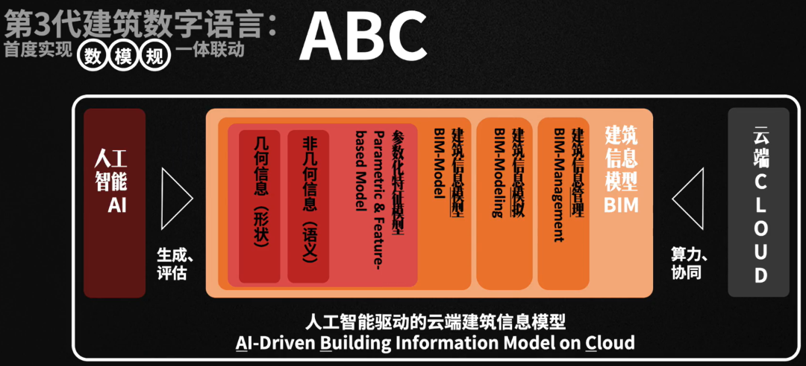

在这个过程中，行业分工和作业方式都发生了很大的变化。建筑设计师的工作平台从 CAD 发展为 BIM、再到现在的泓科晟睿 CSCAD 等，衍生出了 BIM 相关的很多新职业，以及一体化正向设计、装配式建筑等业务模式。

说回投行，整个项目也需要各方在同一数据模型下协作，需要投行领域的 BIM。

在分工方面，目前存在一些尝试，第一种是采购第三方服务，将重复性高重要度低的工作进行外包，比如券商会计师、券商律师、荣大的服务，另一种是参考会计师，集中设置业务中心，比如函证中心。

以数据视角来看，投行项目承做其实存在另外一种分工模式。把数据部分工作单独拿出来，数据团队负责企业尽调数据的采集、处理和治理；项目问题分析与决策均由专业能力更强的决策团队完成；重复性工作行由各业务中心配合完成；每个项目配备项目经理，负责领导协调各方角色，推进项目执行。

### 不要只盯着券商客户

前面分析过，券商投行系统并不是一个好市场，市场规模十分有限，要重新开阔思路。

**1、投行审计法律融合**

IPO 项目除了投行外，还有 2 方中介机构，投行的工作内容与会计师、律师高度重合，大家做的都是企业尽调，IPO 财务核查产品同样可以适用于审计领域的财务舞弊核查。

大陆有投行业务的券商不过百家左右，愿意为投行 IT 付费的券商只有头部的 30 家，但我国的会计师事务所过万家，律师事务所约 4 万家，法律科技、审计科技的市场规模比投行科技更加可观。

IPO 项目中，投行目前 80%的工作量集中于财务核查，但目前投行智能核查产品基本侧重法律部分，在财务核查部分存在很大的业务机会。

同时，投行一体化平台未来很可能也要把会计师、律师的作业囊括进来，各家投行科技厂商很有必要在审计科技、法律科技方向提前进行投资或收购的布局。

**2、服务券商转向服务企业**

律所、会所的数量终究还是少数，这几家中介机构也是要靠发行人吃饭的，投行科技厂商应该把客户目标从服务券商转向服务企业。

荣大就找了一个比较巧妙的商业模式，帮券商干活，找发行人收费。有没有其他的路径，投行科技厂商可以能否为直接服务于发行人？

投行底稿本质上是企业完整的一套融资数据库，企业进行外部融资，无论是银行贷款、金融租赁，还是 PE、VC 投资，各个中介的尽调数据都逃不过投行底稿的范畴。

征信科技可以分为个人征信和企业征信，阿里、腾讯、字节这些互联网巨头，通过 C 端产品获得了大量的个人用户数据，以蚂蚁金服为代表，这些巨头找到了个人征信这条路，可以合法的把个人用户数据转化为收入，做的其实就是类银行的业务，要不是直接放贷，要不然是帮助银行放贷。

企业征信领域的发展，远远落后于个人征信领域，核心原因就在于这些机构拿不到企业真实、完整的数据，拥有企业最多数据的是银行体系，但银行贷款尽调的时候，企业提供的财务报表、审计报告根本不准，提供的资料维度非常简单。

靠爬取企业外部数据进行整合，企查查有了 100 亿的估值。如果你能有企业完整的内部数据，并且让企业授权你进行使用，那能产生什么样的产品形式呢？

### 投行科技市场仍然有机会

在券商投行系统市场，目前的趋势是集中度逐步提高，并且这类系统的研发成本较高，小公司已经没有机会。但在各类细分尽调场景下，有非常多小机会，这些需求更适合创业公司。但如何选择细分赛道，设计商业模式与产品模式，打动 B 端客户，继而实现产业数字化的结果，这是产业数字化最关键也是最难的问题。

券商自建的一体化投行平台，核心目的是管理、控制，能够提升质控、内核的把控能力，但就历史经验来看，项目组与质控会存在冲突，项目组不想对质控开放全部的项目信息，项目组不想让自己完全在公司的控制之下。这也是现在券商建设的很多系统，项目组不愿意使用的原因，项目组天然倾向更晚更少地上传文件到底稿系统。

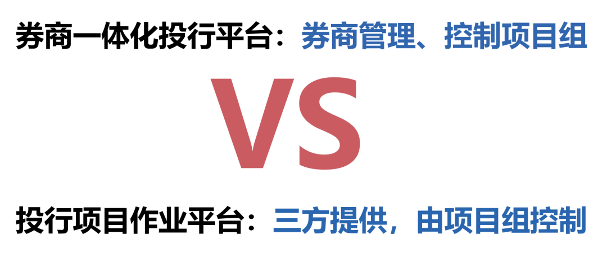

因此，我有个观点，预计争议会比较大。

投行作业平台不会是券商自建的一体化平台，一定是由独立的三方厂商提供，项目组可以独立控制。

这是一个很大的创业机会。

券商一体化投行平台和项目作业平台之间的关系如何，二者的功能该如何区分，是个值得进一步探讨的话题。

### 投行执业质量评价

投行执业评价这事，监管其实很早就开始了。

**三板业务执业质量评价** 。自 2016 年起，股转公司实行主办券商评价制度，16 年 1 月发布《主办券商执业质量评价办法（试行）》，18 年 1 月发布正式稿，19 年 12 月发布《主办券商执业质量评价细则》，分别于 17 年 7 月、20 年 12 月修订《主办券商执业质量负面行为清单》。评价周期分为季度和年度，根据分值将主办券商分为四档，评价结果用于新业务优先试点、与强制培训挂钩、与自律管理联动等。

**债券业务执业质量评价** 。2019 年 10 月 18 日，协会发布《证券公司公司债券业务执业能力评价办法（试行）》，首次能力评价于 2020 年启动，于 2020 年 9 月 25 日发布 2020 年证券公司公司债券业务执业能力评价结果，将券商分为 ABC 三类，占比分别为 30%、50%、20%。

**并购业务执业质量评价** 。13 年 9 月 6 日，协会发布《证券公司从事上市公司并购重组财务顾问业务执业能力专业评价工作指引》，并购业务执业质量评价指标包括证券公司分类结果、业务能力和执业质量三类，根据评价结果将财务顾问分为 ABC 三类。

目前，协会依托投行业务电子底稿监管系统建立投行质量评价信息系统报送平台，归集监管信息、自律信息和行业信息，统一对各类投行业务进行质量评价。评价体系包括内部控制评价（基础分 25 分）、执业质量评价（基础分 75 分）和评价调整（最高 15 分）三个部分。

监管的核心目的是以此提升投行执业质量。但目前的评价体系只能做到保荐机构层面，但实际项目质量更多是由项目组的能力水平、责任心决定，发行人目前选择保荐机构，是没有数据参考的，对具体执行的项目组是没有判断能力的。

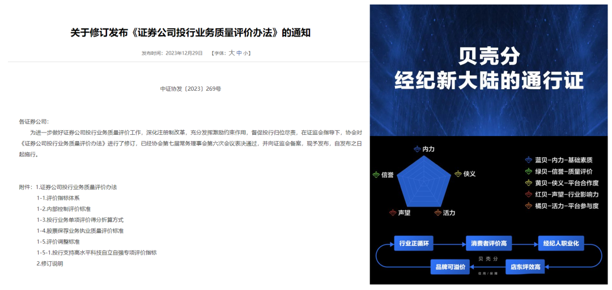

此外，目前的评价数据，缺少了客户的评价数据，客户认可才是真的好。可以在协会现有评价体系上叠加市场评价，提高发行人的判断能力，让发行人用脚投票，实现良币驱逐劣币，促使承揽由关系与资源驱动转向执业质量驱动，具体来说：

**针对从业人员个人** 。可参考贝壳经纪人信用评价体系的建设经验，贝壳经纪人信用评价体系包括五大方面：基础素质（内力）、服务质量评价（信誉）、平台合作度（侠义）、行业影响力（声望）、平台参与度（活力），并纳入发行人、其他合作中介的评价意见，打造投行人员信用评价体系，形成“自我提升与积累优质服务动作——信用分提高——被用户选择机会增加——为更多用户提供好服务——促进更多用户选择”的正向循环链条。

**针对团队** 。在个人评价基础上，综合考虑团队合作时间、过往项目评价结果、能力互补情况、擅长领域等方面，形成团队信用分。

**针对项目** 。综合考虑申报材料质量、信息披露准确性、核查完整性、底稿质量等方面进行评价，并与个人、团队评价相挂钩。

这其实是中介机构版的大众点评。

### 证券行业大模型建设

**1、建设思路**

国金证券团队在一篇文章提出了大模型在证券行业的建设思路，非常具有参考价值。

**大模型与现有系统的结合模式**

证券 IT 系统必须高度稳定可靠，对大模型的容错度较低。因此，大模型与现有系统的集成应遵循由松至紧逐步耦合的原则，采用外挂式、嵌入式和原生大模型相结合的方式来进行大模型的应用。

外挂式是数据查询的模式，用大模型做 IT 系统的数据查询，用大模型对反馈数据进行内容整合；内嵌式是 ChatPDF 的模式，指在 IT 系统嵌入大模型接口，让对该系统不熟悉的人员通过交互式问答方式使用系统；AI 原生是指采用行业数据和信息，进行大模型的微调，使大模型具有该行业的属性。

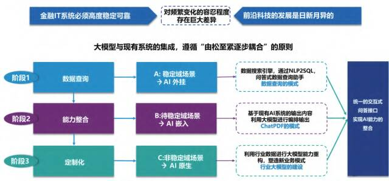

**AIGC+RPA 重构软件系统**

将 RPA 和 AIGC 结合，让机械手臂的动作与机械大脑的思考相互配合，自动化处理重复任务。具体场景包括自动调用 API、自然语言代替 SQL 语句、自动化生成前端代码等。

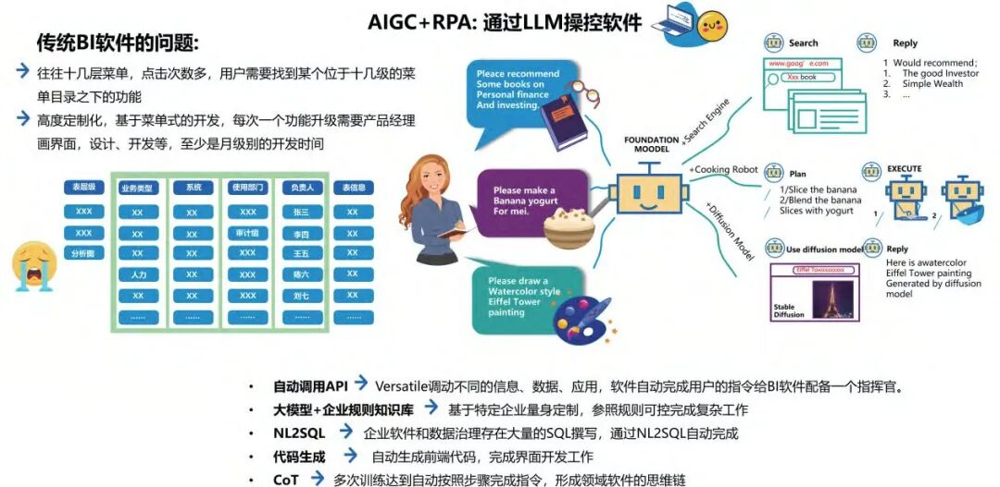

**可兼容信创 GPU 的弹性算力池化**

为充分利用现有 GPU 算力，将 GPU 资源池化能力扩展到整个数据中心，解耦 AI 应用和 GPU 服务器，实现弹性调度 GPU 资源。该方案兼容英伟达 CUDA 生态和国产 GPU 体系 NeuWareROCm，能建设异构的 GPU 算力集群。基于国产 GPU 生态体系，可以构建信创大模型和算力资源池。

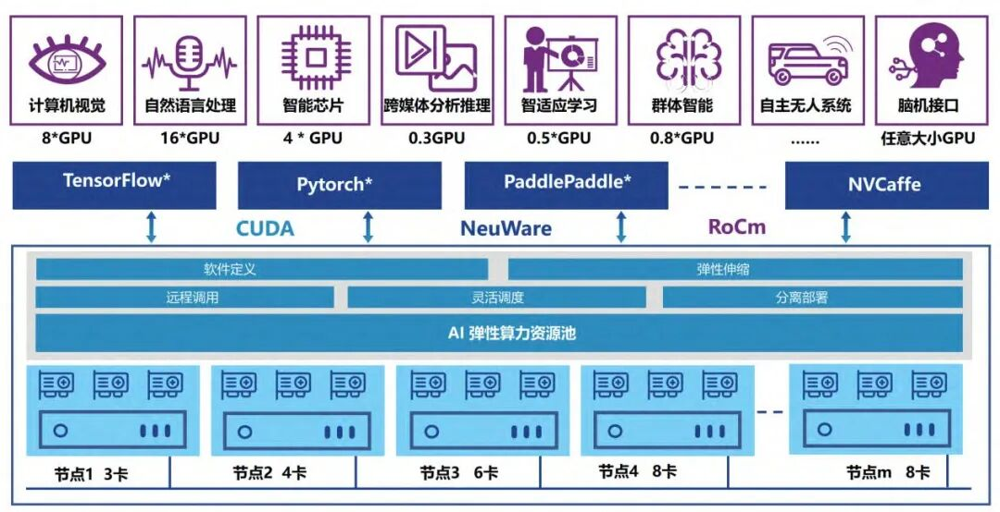

**2、技术路径**

金融行业应用大模型的落地有以下几个角度：

>   * 模型类型：通用模型与垂类模型
> 
>   * 部署方式：公有云部署、行业云部署、私有化部署
> 
>   * 合作路线：用开源模型、采购商用模型、产学研联合研发模型、自研
> 
> 

不同券商，结合自身规模、数据敏感程度、业务场景价值，会有不同的路径选择。国金证券提出了几种路径：

**预训练通用大模型**

利用大规模数据集和语料库训练出的垂直领域的大模型具有丰富的专业领域知识和强大的文本生成能力。例如，彭博社基于自主构建的 FinPile 数据集训练的 BloombergGPT，已经被证明能够比通用大模型更好地处理金融领域的数据和任务。此种方式成本较高。

**基于通用大模型进行参数微调**

参数高效微调的主要思想是在保持原有大模型全部或绝大部分参数不变的基础上，通过增加或改变少量参数的方式改善模型在特定任务上的性能，受影响的参数量通常仅为全量参数的 0.1%左右。主流方法包括 P-Tuning、LoRA 等。

大模型参数微调的训练成本适中，在行业场景对话效果良好。然而，该方法可能面临灾难性遗忘的问题，即模型在学习新任务或适应新环境后会忘记甚至是丧失以前习得的知识，造成模型性能大幅下降。

**基于外部知识库和提示工程对通用大模型调优**

提示工程通过构建和优化输入来引导大语言模型生成更加精确、可靠和符合预期的输出文本，能够有效激发通用模型的迁移学习能力，从而提升在目标领域的应用效果。

针对证券行业的特点，选择基于外部知识库和提示工程对通用大模型调优技术方案最合适。首先可以构建包含专业术语、产品信息、股票行情等结构化信息的外部知识库，然后通过知识库检索以添加融合了证券知识的提示对通用大模型进行调优，使大模型学习证券领域的语言表达方式以及业务逻辑知识。

国金证券选择的是 LangChain+智谱 ChatGLM2 结合的技术路线，进行模型的微调和领域知识库的训练。在保留良好对话效果的同时，其训练成本非常低，能够有效避免模型微调后的灾难性遗忘问题以及减少模型出现幻觉的情况。

* * *

投行科技的发展任重道远，但我仍然坚信，投行数字化能把投行推向下一个更高质量的发展阶段。

现在的市场环境下，从业的朋友们都挺难的，最近在看喜人奇妙夜的时候，杨天真的总结发言非常适合当下，就用这段作为本文的结尾吧。

这个职业，有的人是速度，有的人是高度，有的人是长度。要理解这个职业背后你的目标是什么，因为只有那个坚定的目标才可能让我们穿越黑夜，才能够让我们在事业高点的时候不骄傲，才能够让我们再掉下来的时候穿越整个周期，因为这注定就是一个起起落落的行业，所以祝各位坚持跟享受。

