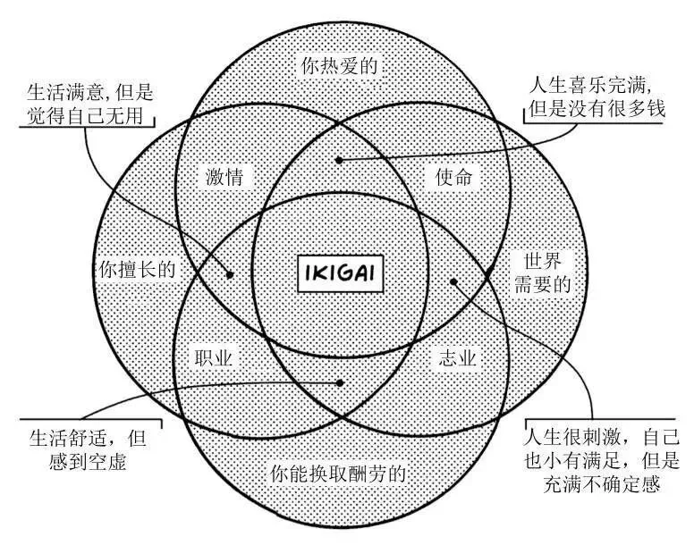
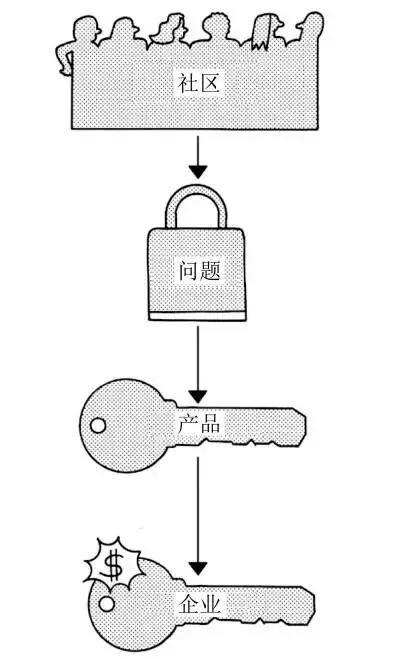
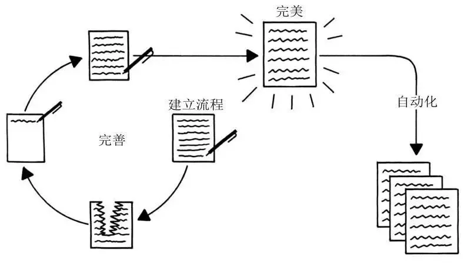

**产品能力是个人竞争力的重要体现**

纳瓦尔认为，想致富，用杠杆。杠杆有三种，**劳动力、资本、代码或媒体。**

个体实现价值的方式一般有2种：打工，是**出租时间**；另外，通过**产品**为客户解决问题。

产品可能是代码，可能是实物，也可能是服务。产品会变成股权，也就成为了资产，也会是媒体，有助于扩大个人的影响力。

另一方面，与法律、编程一样，做产品有利于形成对应的思维方式，让人更具同理心，更容易发现问题、解决问题，对个体会有更深远的影响。

大部分人都不愿迈出做产品的第一步。

在这强烈推荐下乔布斯[《遗失的访谈》](https://www.bilibili.com/video/BV1jM4y1W7gM/)

## 咋做产品

做产品是有方法的，网上的资料也非常多，我就推荐一本书吧：**《小而美：持续盈利的经营法则》**，里面有非常具体的操作指引，附上几张很喜欢的插图。

 
如何寻找目标

---

 
步骤

---

 
产品完善流程

