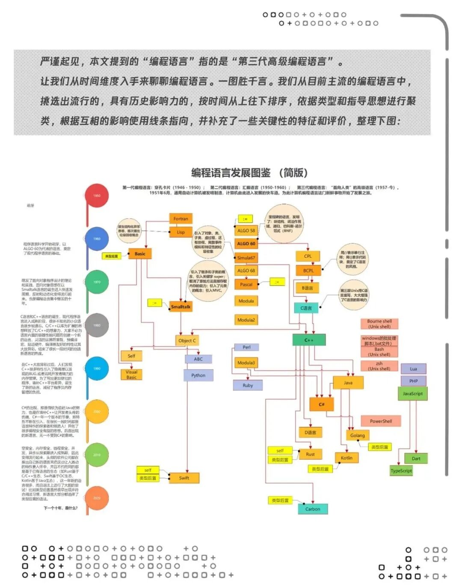
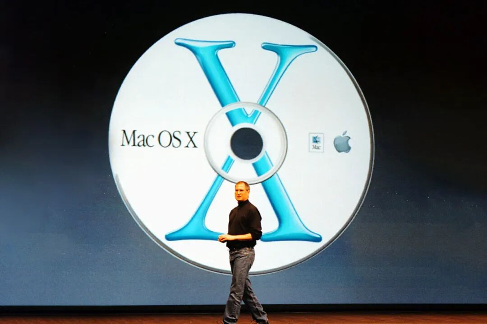
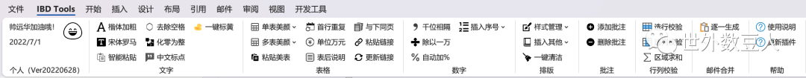
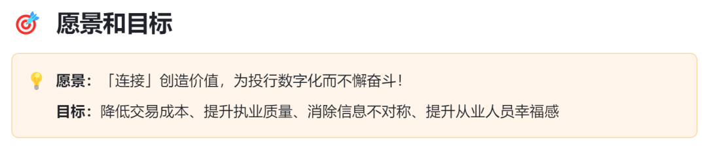

李笑来说过：「类比常常是产生**融会贯通**的手段」。

为了寻找投行数字化转型的答案，我总会从其他行业的发展历史中寻找灵感，软件行业就给了我很多启发。

**编程是一种思维方式**

从编程语言发展史看，主流编程语言主要受2个成熟语言（**Smalltalk和C语言**，且都诞生于1972年）的影响，有的语言被某个影响深一些，有的两者都汲取；接着主要往**更安全、人性化、跨平台**这三个方向进行发展，而在**性能、语法、重用生态、扩展性、IDE友好**等多维度各有发展、取舍、借鉴。同时，编译型和解释型语言边界逐渐模糊，语法流行交替更迭，语法语义更加明确，语言的目标领域更加细化。

编程语言底层上是由编程思想的发展推动的，从面向机器到面向过程，再到面向对象。

1995年，乔布斯在《遗失的访谈》提到过，1979年底，乔布斯参观了施乐公司，施乐向其展示了三个项目——**面向对象编程、计算机网络系统和图形用户界面**。图形用户界面给了乔布斯非常大的启发，这才有了后续个人电脑的蓬勃发展。但在当时，乔布斯忽视了面向对象编程，直至他被赶出苹果，并创立NeXT，采用面向对象编程技术，将软件开发速度提高十倍，而且质量更好。

上述访谈一年后，苹果收购NeXT，乔布斯重新执掌离开了12年的苹果，NeXT公司的操作系统NeXTSTEP最终变成了苹果的OS X。

面向对象的底层理论是**关注点分离**，是将程序分隔为不同部分的设计原则，由于关注点混杂会大大增加程序复杂性，所以需要把不同的关注点分离，分别处理，简化程序的开发和维护。

同时，编程是一种思维方式，乔布斯在《遗失的访谈》说过：

> 编程可以帮助我们完成工作，它没有明确的实用性，重要的是我们把它看作思考的镜子，学习如何思考。
> 
> 我觉得所有美国人都应该学习编程，学习编程教你如何思考，就像学法律一样，学法律的人未必都成为律师，但法律教你一种思考方式，同样编程会教你另一种思考方式。

铺垫了这么久，说回对投行的启示。

**1、投行也是一种思考方式**。工作生活中，看到具体的产品，会本能思考背后的公司是谁、同行业龙头是谁、是否已经上市，行业上下游情况、业务模式、核心竞争力、IPO审核要点、收入利润毛利率等财务指标特点，是否有投行业务机会、是否有投资价值等等。

**2、关注点分离在投行的应用**。核心是复杂问题的解耦，也可以理解成模块化。无论是投行业务层面的实务知识、项目问题解决，还是投行科技产品的功能分类、产品开发，都可以应用该思想。

**3、理念转变**。目前行业最缺的是理念转变，需要**从审核视角转为数据视角**，用数据类工具解决当前的业务问题。

**4、可编程**。陆奇说过：

> 技术的本质是**用信息去转化能源**，改变自然现象，满足人的需求。
> 
> 技术的结构有两个组成部分：**可编程**，任何技术都有信息部分；**可执行**，有能源转化部分。

投行业务环节中，95%以上是信息部分，一方面，需要用编程的方式，让机器自动化完成投行承揽承做过程中的特定任务，实现降本增效提质；另一方面，投行数字化的瓶颈在发行人自身的数字化，必须采用可编程的方式去解决，而不是现在的人工手动，既可以是完成编程的产品，也可以是业务人员可自定义配置的无代码/低代码工具。

## 生态繁荣

**1.工具生态繁荣**

软件行业业务类型多、业务环节复杂，衍生出了非常繁荣的工具生态，例如：

- **开发框架**：NestJS、Tailwind
- **部署方案**：Vercel、Cloudflare、Netlify、Zeabur
- **存储方案**：Supbase、Planetscale、Vercel Postgres

以及支付方案、设计工具、数据分析、自动化、表单方案、邮件方案等不同环节的各类工具。

工具生态的繁荣，大大降低了开发门槛，促使软件行业加速发展。

投行的承做场景分散，需要的底层技术复杂，比如IDP（Intelligent Document Processing，智能文档处理）、OCR、RPA等，目前部分厂商已经支持将技术能力通过接口方式提供给三方使用。

投行、审计行业很多从业者为了解决工作中的问题，以VBA为主开发了很多小工具，比如IBD Tools、方方格子、审计工具箱等，几乎都由个人开发者为爱发电，但很难实现商业收益。

投行科技领域，需要**更加健康、可持续的工具生态**。

## 社区生态繁荣

软件开发者这个群体特点十分鲜明，具有创造性、独立性，蔑视权威、追求专业，并且非常愿意分享。

这群开发者造就了繁荣的软件社区生态。从70年代的SPICE、TeX、Unix到80年代的GNU、MIT X联盟、Aladdin，再到90年代的Linux、Apache，继而是21世纪的Github等。

社区生态对软件行业产生了多方面的深远影响，促进技术的快速迭代，推动行业创新，提升软件质量，降低开发门槛，促进知识共享，并衍生出了**开源思想**以及许多商业机会。

典型的社区案例包括：

- **Github**：全球最大的代码托管平台，也是拥有大量开发者和项目的活跃社区
- **Hacker News**：由保罗·格雷厄姆于2007年2月创建，是知名创投Y Combinator的一个项目，帖子主要关于计算机和创业领域，以高质量的内容和活跃度而闻名
- **Indie Hackers**：创立于2016年，一个为独立开发者提供支持和灵感的社区，并衍生出了**独立开发者**的概念以及**FIRE**（Financial Independence, Retire Early，财务自由，早早退休）的生活方式
- **Product Hunt**：2013年由Ryan Hoover创立，2016年被知名的AngelList收购。Product Hunt的核心价值在于构建了一个专注于新产品发现、讨论和评价的社区，已成为SaaS产品（尤其是出海产品）发布的首选平台
- **V2EX**：2016年由刘忻（Livid）创建，一个由设计师、程序员等参与的创意工作者社区

在这里，必须要说一下Github对软件行业的深远影响。自2008年成立以来的十多年，Github变革了软件开发协作方式、推广了开源文化、促进了开发者的职业发展，也催生了**行业标准与最佳实践**。2015年，Github被微软以75亿美元的天价收购。在当前的AI时代，Github的数据提供了高质量的数据集，使微软与OpenAI合练了模型**GitHub Copilot**，进一步改变了软件开发的范式。

说回投行，投行的社区生态与互联网发展关系密切，从博客、微博再到公众号，一批从业者通过分享实务经验、法律法规、实用工具等，成为了圈内的网红，如老一代的@劳阿毛、@投行小兵、@投行泰山、@合规小兵、@春晖投行在线、@刺客见闻，新一代的@逆行的狗、@世外数豆人、@投行wen言wen、@搬客、@投行大白、@茶瓜子的休闲馆、@效率视界等。

投行论坛中，最知名的应该是投行先锋，但现已沦落为保代培训班的宣传渠道，未能承担起投行社区的使命。

会计领域最知名的论坛是会计视野，活跃度主要靠陈奕蔚老师十几年的持续付出。

资本市场业务法律领域，好像没有相关的论坛。律师更多是通过个人、团队或公司的公众号披露专业文章，建立个人品牌。

资本市场领域，需要有一个**高质量的社区**，**既是知识库，促进知识平权，也是Linkedin，实现中介品牌建设及项目承揽**。

## 软件开发范式变革与开源思想

中科院院士王怀民把软件开发范式分为以下几类：

- **工程范式（个体创作到规模化生产）**：把现代企业的管理思想、方法和技术用在软件工业的管理过程中，研究与软件生产相关的自动化工具
- **开源范式（规模化生产到大规模创作）**：通过自组织的社区群体，鼓励开展软件作品的自由创作
- **群智范式（大规模创作到群智开发）**：联接自由创作与规范生产，实现软件作品与软件产品之间的转化

上述范式变革中，开源思想起到了非常重要的作用，能够加速创新，促进行业形成最佳实践。最典型的开源支持者是马斯克，他认为**专利是弱者的游戏**。特斯拉、SpaceX、Grok均已开源了全部或部分专利，一定程度上促进了电动车、商业航天、大模型行业的发展。

反观投行科技行业，由于市场规模太小，收入不足以支撑三方厂商持续研发，券商为了自主可控，更倾向于集成三方厂商的能力下的自研，一定程度抑制了三方厂商的发展。此外，由于竞争关系，不同券商的投行IT部门之间极少沟通，并且会尽量对自身投行数字化情况进行保密，这也抑制了行业的发展速度。

数字化能把投行推向下一发展阶段，两个核心是**标准化**和**科技**，开源有助于加速标准化，也就是标准化业务流程和最佳业务实践。

投行这个行业，不只是业务层面，也包括IT层面，都需要更多的连接。

就像**投行百宝箱 | WiKi**的愿景说的，**「连接」创造价值**，连接是知识之间的连接，如法规、尽调问题、解决措施、案例之间的关联，也是**人与知识、人与职业机会、人与发行人、人与人**之间的连接，希望我们能在这个过程中起到一点点的正向作用。

## 延伸阅读

1. [[中小券商投行差异化竞争新思路]]，投行百宝箱，高铭哲
2. [类比及其方法论](https://b.xinshengdaxue.com/A09.html)，李笑来
3. [乔布斯《遗失的采访》视频](https://www.bilibili.com/video/BV1jM4y1W7gM/)
4. [[IPO就是数据建模-投行数字化的瓶颈在发行人自身的数字化|IPO就是数据建模，投行数字化的瓶颈在发行人自身的数字化]]，投行百宝箱，高铭哲