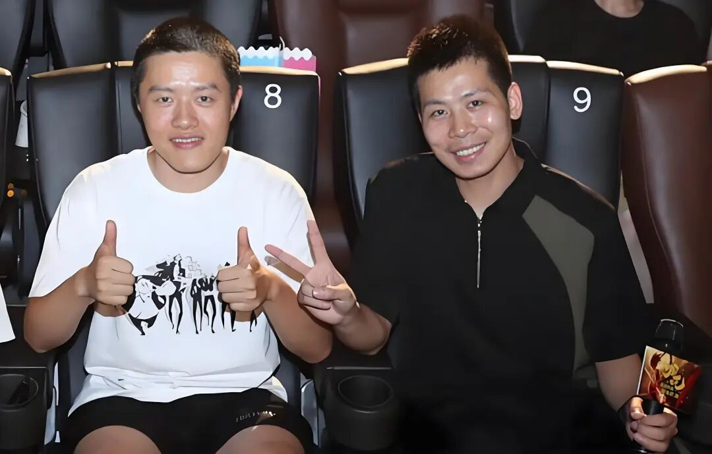
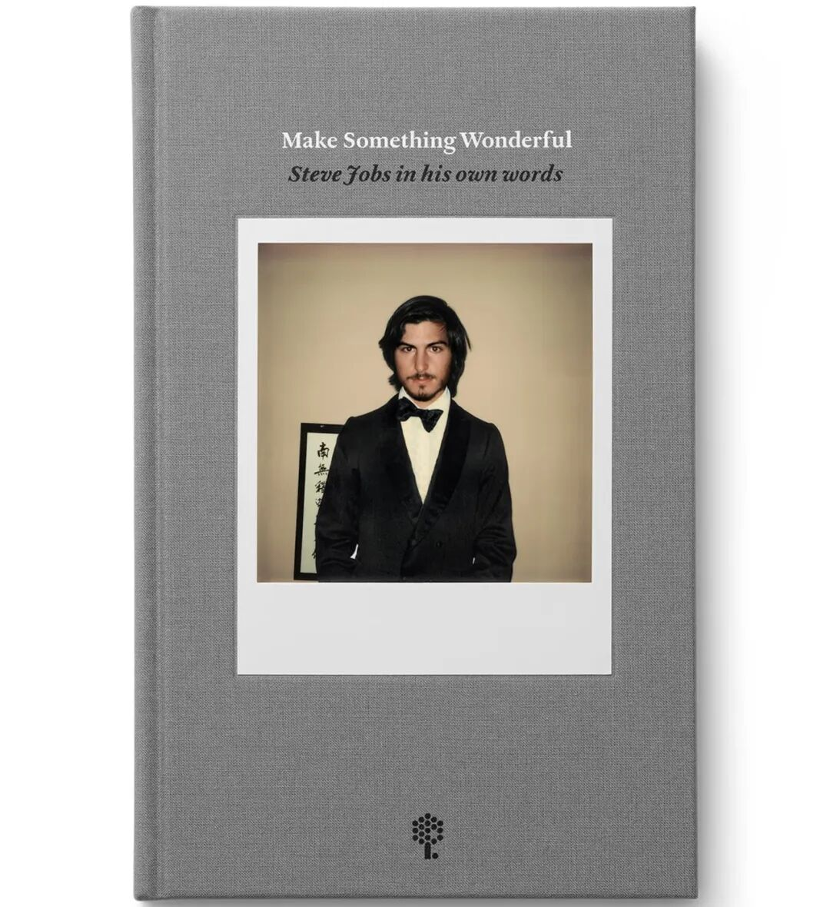

![[Pasted image 20260407203548.webp]]

哪吒2爆火，最大赢家是光线传媒。相比于最终票房数字，我更感兴趣的是光线是如何发现投资机会的，以及这笔投资的决策逻辑。

一切得从2015年开始讲起。

15年夏天，国产动画电影《大圣归来》横空出世，上映第四天，王长田决定，光线传媒出资2000万，与《大圣归来》的导演田晓鹏成立了十月文化。早在三年前，田晓鹏就曾找过光线传媒，但王长田一直犹豫不决。《大圣归来》的八年制作周期里，资金极度紧张，但田晓鹏始终没有等来光线的注资。

15年，曾参与《泰囧》的宣传策划经理易巧向王长田主动请缨，成立了光线传媒旗下第一家创业公司彩条屋，专攻动画电影制作，对标迪士尼、皮克斯。

从0到0.1，彩条屋只有易巧一个人，动漫的核心在人，他要找到全国最好的动画短片导演，其中就有饺子。

19年，彩条屋影业CEO王竞在《哪吒1》郑州见面会上说：**「我们选导演的标准有两个，第一个是穷，第二个是但依然坚持着」**。

这是一个非常好的人员筛选模型。

穷，意味着市场价值低估，是好的投资机会。

坚持，可以扩充为「坚持做好东西」。穷但依然坚持，意味着心底有原始动力。下半句，不是**做好「东西」**（Finish work），而是**做「好东西」**（Make something wonderful）。

YC有句slogan，「Make something people want」，意思是要创造用户需要的。

但我更喜欢另一种表述，「Make something wonderful」，乔布斯要创造的是能称得上wonderful的作品。

书籍《Make something wonderful》，乔布斯的演讲、访谈和书信的精选集，由史蒂夫·乔布斯档案馆（Steve Jobs Archive）出版，免费在线阅读链接(https://stevejobsarchive.com/book)。

无论是YC，还是乔布斯，都在强调「创造」的重要性。

要做不足0.1%的创造者。我有个6岁半的儿子，我会思考他的教育问题。对他来说，最重要的事有几件：

- 尽早找到人生热爱的方向
- 掌握学习能力
- 见自己，有强大的内核
- 至少学会一种创造技能，可能是写作、画画、摄影、编程、设计、策划，能将想法变成作品，与世界交互，产生价值

而something wonderful可以翻译为「作品」，形式包罗万象，可能是代码、文章，也可以是视频等其他形式。我最近看到的wonderful things包括：

**1.书籍**

- 《Make something wonderful》《心若菩提》《褚时健传》

**2.视频**

- 《史蒂夫·乔布斯：遗失的访谈》

- 电影《好东西》《哪吒之魔童闹海》《回到太空》

- 喜剧之王单口季（付航全部作品、阎鹤祥的2段作品）、喜人奇妙夜《八十一难》

- 《扬声》第三期：张扬对话冯骥

- 《【何同学】你再也回不到19岁的夏天了》

**3.产品**

- 夸克网盘
- DeepSeek
- 黑神话悟空

在日常生活中，平均水平与最佳标准的差异最多2倍；在软件领域，也包括过去的硬件领域，二者的差异可能是**一百倍**。想要做出百倍好的产品，关键在于**找到真正有天赋的A player**。当有足够的A player时，团队会非常喜欢合作，并吸引更多的A player加入，因为他们讨厌与BC级别的player合作，这就是乔布斯的Mac团队。

好东西吸引一流人才、客户、合作伙伴，创造巨大价值、商业回报、社会影响，所有的一切，都源自**做好东西的愿力**。
