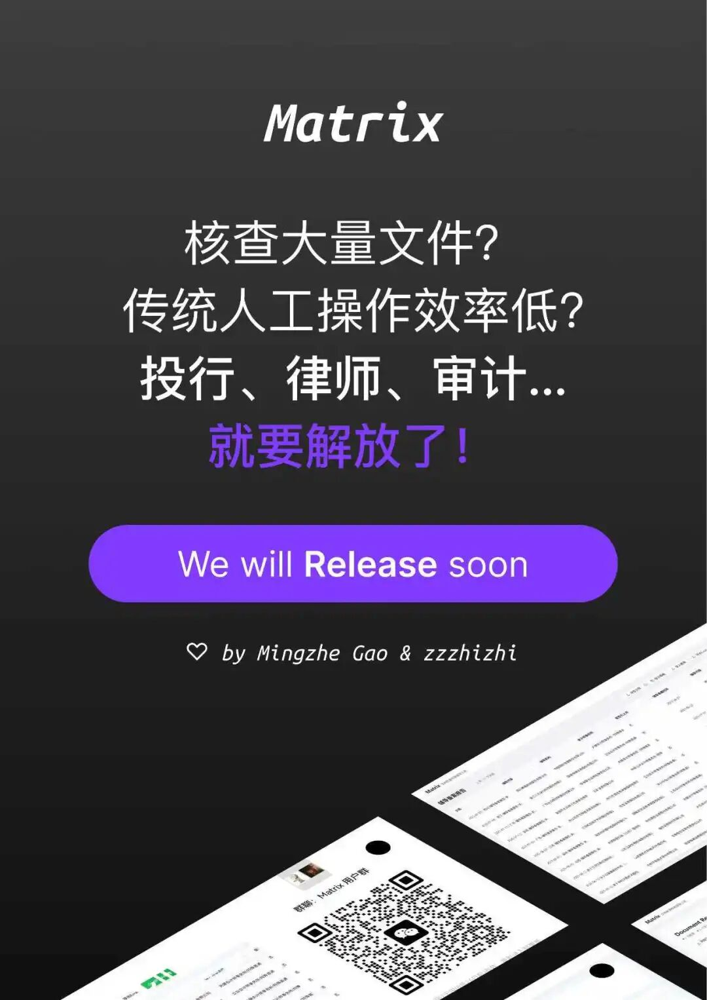

![[eb70e75a5c90d459204a7fd2b43e4189.jpg]]

上周日参加了AI hacker house组织的黑客松，我是第一次参加，抱着观摩学习的态度。

活动要求最多2人一队，我随机跟旁边的男生组了队，就叫他小孩哥吧。

我们做了个文档批量智能提取工具，我负责出产品需求，用GPT5帮我梳理了个简单的PRD，同步小孩哥后，他负责全栈开发，只用了6个小时，搓了个demo，最终在29只队伍中夺冠。

以下是我们组的产品demo演示：

这次活动，一大半的震惊来自于小孩哥，他只有17岁，是一名高二学生，从四年级开始自学编程，在高中组织成立了计算机社团并担任社长，这是他参加的第三次黑客松，也是拿到的第一个冠军。

demo虽然简单，但前端页面、后端部署、调用gemini模型，还是有不少工作量的，小孩哥全程使用claude code max，同时开2-3个线程，夹了个领夹麦来语音输入指令。

我问他，怎么会使用这么贵的claude code max，他说是公司买的，他和另一个朋友已经上线了一款英语单词学习的web产品，并实现盈利，那个朋友在北京，刚刚满18岁，正在注册自己的公司。

产品网址：www.clingword.com

在demo展示前，他竟然还用PS、Figma，做了一张宣传海报！

活动结束后，我请他吃饭，他说自己的梦想就是创业。

昨天，买了域名，今天已经上线，我是真心佩服小孩哥的执行力。

感兴趣的朋友可以试试demo的效果，产品网址：file2table.com

令人印象深刻的还有另外一组，两人是大学同学，97年左右，一位是产品背景，现在自己做了家广告咨询公司，10多人，年营收近2000W，一位是独立开发，大半天的时间，俩人搓出来一个完整的AI 驱动的达人营销SaaS平台，复杂页面将近20个。

以前只是在新闻里看到AI coding的热闹，今天，我真切感受到了AI的影响，以及软件开发的范式变化。
