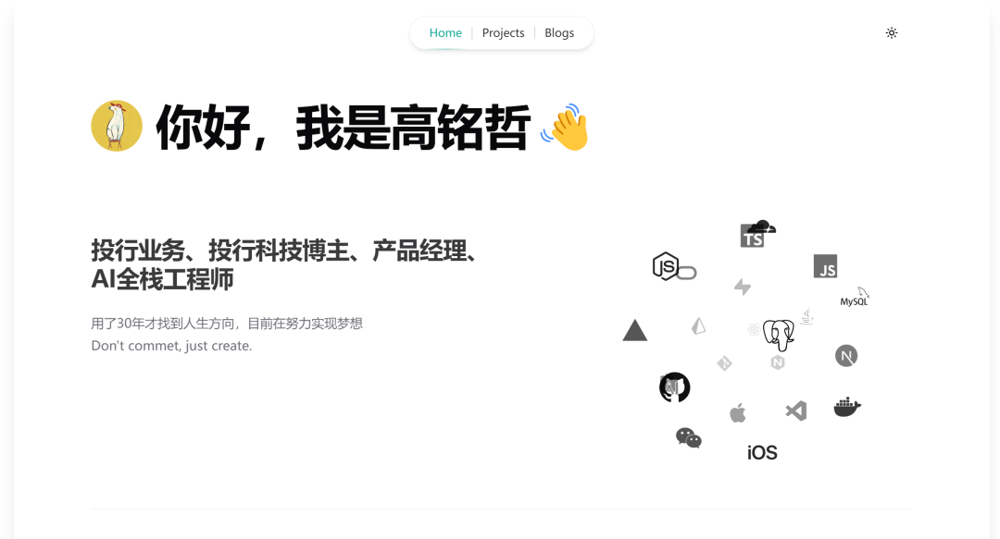
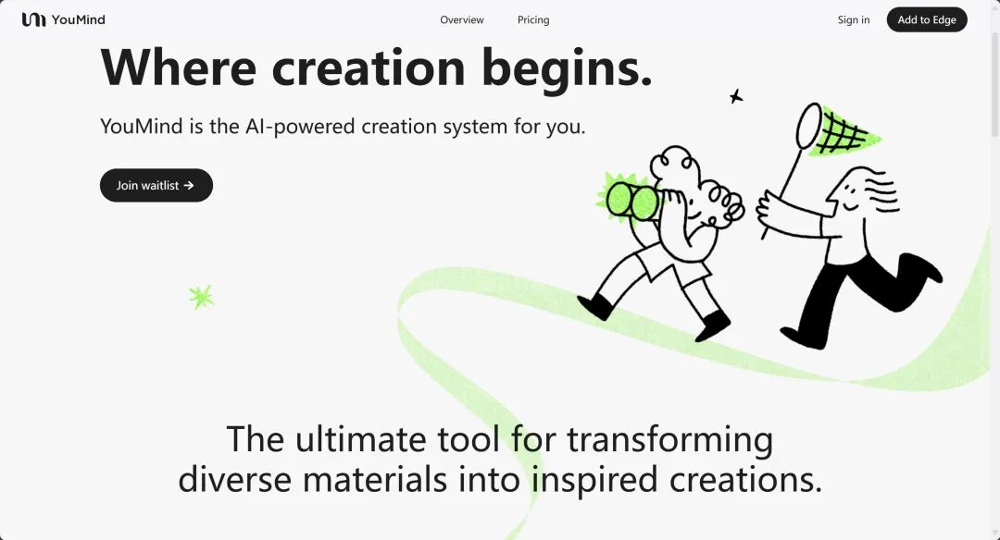

## 工具

我的编程经验很有限。

大学时学过 C 语言，仅限于输出个*组成的正三角和倒三角。工作后有过很多关于投行的产品想法，因为不会编程，所以尝试过用低代码平台代替，前后尝试过好几类：

1.表单式。如飞书多维表格、明道云、宜搭、简道云、奥哲等，简单的组件拖拉拽，配上工作流，就能实现简单的 CRM、进销存管理等。

2.Figma 式前端+后端一键部署。如国外的 Bubble、国内的 Zion 等，相比表单式有更高的自由度，能设计出更复杂的产品。前端类似 Figma，用类似画 PPT 的方式画前端页面，后端配置工作流、接 API，一键实现部署。我用 Bubble 做了个尽调文件搜集的 SaaS，能够实现完整工作流，问题在于对文件管理的能力弱，开发效率低。

大模型带来了 2 类新工具：

3.编程 Agent。如 Bolt、V0、Replit、Uizard、Galileo AI 等，可一句话生成前后端代码，大大降低了开发门槛。

4.AI IDE。如 Cursor、windsurf、Cline 等，除了有 Agent 相同的一句话生成代码的能力外，在 IDE 环境内有更丰富的功能，能够对代码进行更高精度的控制。

这四类工具，给用户的**自由度**越来越高，在 AI 的加持下，使用门槛也大幅降低。

对于有编程经验的开发者来说，AI IDE 大幅提升了单兵作战能力，很多开发者选择成为独立开发者，一人做出海产品赚美元，国外较为知名开发者如 Pieter Levels、Marc Louvion 等。

技术发展会降低使用门槛，用户范围由专业人士构成的小众圈子扩大到普罗大众，进而改变行业生态，在创造性行业尤是如此，软件行业目前就在转折的节点。越来越多的非开发背景人员，开始尝试通过 Cursor、Windsurf 把想法变成产品，做 IOS 应用、SaaS 等。

## 尝试

我没有编程经验，最近，通过搜索引擎、Youtube、DeepSeek 解决问题，研究 Github、Vercel、Cloudflare 的使用，通过 Windsurf 用自然语言编程，做了个简单的个人网站，gmz666.com^[此域名已不维护，更新为gaomz.com]

AI 让没有技术背景的人体验编程的乐趣、创造的乐趣。

我在即刻、X、Youtube 上开始关注开发者，线下约到了玉伯，聊他的 YouMind 产品设想、AI 在写稿方面的应用，既包括泛创作领域的内容，也包括招股书类的专业报告。

玉伯是语雀创始人，曾就职阿里、字节，目前创立思维天空，产品 YouMind 定位是成为面向创作中长内容的创作者工具，帮助创作者找资料和撰写稿件。如果你是图文、播客、视频、短视频的创作者，推荐你试试，注册就有 15 天会员，网址：youmind.ai

## 投行

对我来说，研究编程像是打开新世界的大门，给我在投行方面带来了很多启发。我之前写过一篇[[软件行业对投行发展的启示]]，再补充些最近的想法。

代码有非常强的逻辑性，编译能否通过、功能是否有效都是非常确定性的结果；投行领域，尤其是 IPO 业务，结果具有高度不确定性，尤其是在当前的政策和市场环境下，大批的人才因为不确定性放弃了这个行业。

投行、审计、法律、咨询这些专业服务，交付的成本是时间，是有上限的，而软件可以覆盖十亿级的用户。

投行业务主要围绕上市公司、拟上市公司，需求严重受政策影响。目前，对于投行新人来说，最大的问题是没有真实项目去参与，没法在项目上历练、成长，只考证、研究案例是不能够满足业务需求的。目前投行还没有产品化的思路，没有做到差异化针对细分客户提供对应产品。软件开发领域的很多思想是远超投行的，例如需求分析、项目管理、协作方式、版本管理，甚至是思维方式。

投行工作有三部分：**做尽调、写报告、推流程**。我相信，前两部分在技术加持下，也会经历**降门槛、扩用户、改生态**的过程，做尽调和写报告的能力平民化之后，能衍生出什么样的产品和业务机会，还是挺值得期待的。